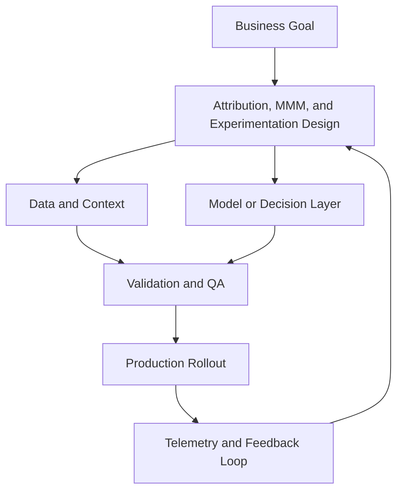

---

## 🏗️ Your Running Project

**What you're building:** You are building a full-funnel campaign for a SaaS product launch — from audience targeting to conversion measurement.
**What this module adds:** Build the measurement component.

> *Every decision here carries forward.*

# Attribution, MMM, and Experimentation

## Summary

Build a triangulated measurement system

## Outcomes

- Build a triangulated measurement system
- Design incrementality tests
- Use measurement for budget reallocation
- Choose the metric that governs spend under disagreement

## Theory

- MTA limitations and bias
- MMM design basics
- Experiment hierarchy and causal inference
- Baseline versus incremental value
- Attribution triangulation under signal loss
- Decision rules when metrics conflict

## Practical

- Draft a channel-level test plan
- Create an MMM input data checklist
- Build a budget decision tree
- Write one holdout design for a spend cutover
- Define the reporting order for platform, MMM, and experiment data

## Tools

GA4, Amplitude, Statsig, Northbeam, Lightweight MMM scripts

## Case Study

- **Protagonist:** CFO and CMO
- **Context:** Platform ROAS says up, finance says payback period worsened.
- **Dilemma:** Trust platform dashboards or cut spend aggressively?
- **Options:**
  - Use last-click only
  - Run geo holdout + blend with MMM
  - Freeze acquisition until reconciliation complete
- **Recommendation:** Run holdout tests and triangulate with MMM before major budget cuts.
- **Discussion questions:**
  - ROAS and payback disagree. Which source governs budget this quarter, and why?
  - What is the first experiment you run to resolve the conflict, and what result changes spend?
  - Which number is baseline, incremental, or marketing-induced incremental value?
  - What would you do if the platform looked strong but holdout results were weak?

<!-- VNEXT_AUGMENTATION -->
## vNext Lesson Augmentation

### Meme opener

### Quick Recap
- Start with a business outcome and measurable success criteria.
- Design the operating workflow before selecting tools.
- Add validation, observability, and rollback controls from day one.
- Use lightweight artifacts so decisions are auditable and repeatable.

### Concept Clarity
Think of this module like building a smart kitchen. The recipe (process), ingredients (data), and tasting checks (evaluation) matter more than buying the fanciest oven. If one part fails, you need a backup plan so dinner still gets served.

### System map (mermaid)

### Harvard-style case
**Case:** Attribution, MMM, and Experimentation in a mid-market business unit.  
**Background:** Team needs faster execution without losing governance.  
**Complication:** Metrics are improving in pilots but unstable in production.  
**Analysis:** Missing control points (ownership, QA gates, and incident rules) increase variance.  
**Recommendation:** Introduce a phased operating model with explicit guardrails, then scale only when KPI and risk thresholds hold for two consecutive cycles.

### Primary references
- [NIST AI RMF](https://www.nist.gov/itl/ai-risk-management-framework)
- [Google SRE Workbook (SLOs)](https://sre.google/workbook/)
- [Harvard Business Review (Analytics & AI)](https://hbr.org/topic/analytics-and-ai)

### Downloadable artifacts
- [Module worksheet](/assets/courses/martech-adtech-academy/downloads/measurement-worksheet.md)
- [Execution checklist (CSV)](/assets/courses/martech-adtech-academy/downloads/measurement-checklist.csv)

### Media links
- [Module media list](/assets/courses/martech-adtech-academy/videos/measurement-media.md)
- [MIT Sloan AI channel](https://www.youtube.com/@mitsloan)
- [Stanford HAI talks](https://www.youtube.com/@stanfordhai)

## 😄 Meme Opener

## Video Boosters
- **Quick Recap video:** [Watch](/assets/courses/martech-adtech-academy/videos/measurement-quick-recap.mp4)
- **Concept Clarity video:** [Watch](/assets/courses/martech-adtech-academy/videos/measurement-concept-clarity.mp4)

---

## 🎓 Harvard-Style Case Study — Marketing measurement governance and single source of truth

**Context:** A team had 7 different dashboards for the same campaign. Each used a different data source. The marketing team and the CFO had different numbers for the same metric.

**The tension:** Ship the campaign vs build the process control that prevents the failure.

**Decision options:**
1. Establish a single source of truth for each metric before building any dashboard
2. add a data dictionary that defines every metric consistently
3. require finance sign-off on all marketing metrics definitions

**Discussion questions:**
1. What signal would have caught this before it damaged the business?
2. Which option gives the best risk/effort tradeoff for a lean team?
3. Write a one-sentence policy that would prevent this failure mode.

---

## 🤖 Solo AI Discussion Prompt

**Red Team:** "You are reviewing this marketing decision. Find the top 2 ways it will fail and how to close those gaps."
