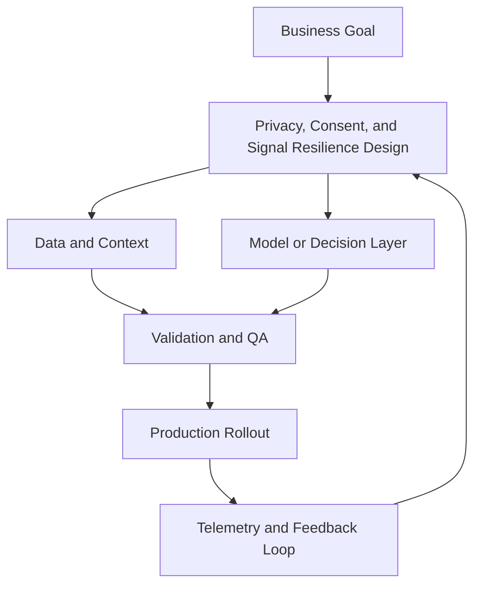

# Privacy, Consent, and Signal Resilience

## Summary

Implement consent-aware measurement

## Outcomes

- Implement consent-aware measurement
- Design resilient signal pipelines
- Map compliance obligations into system design
- Pair consent mode with deduplicated server events

## Theory

- Consent mode patterns and defaults
- Client-side versus server-side collection
- Data minimization and retention strategy
- Event deduplication across browser and server
- Compliance as measurement design, not afterthought
- Modeling fallbacks when signals are missing

## Practical

- Build a consent-state matrix
- Classify events by legal basis and purpose
- Define fallback measurement strategy
- Mark which events require server-side handling
- Document deduplication keys for critical events

## Tools

GTM Server-Side, OneTrust, Didomi, Meta CAPI

## Case Study

- **Protagonist:** Regional marketing director (EU launch)
- **Context:** Legal requires strict consent implementation before expansion.
- **Dilemma:** Comply quickly and lose attribution quality, or delay launch?
- **Options:**
  - Ship with minimal tracking
  - Build consent mode + server-side implementation
  - Delay market launch until full stack rebuild
- **Recommendation:** Launch with consent mode, server-side critical events, and model-based measurement fallback.
- **Discussion questions:**
  - Legal says consent controls must go live before launch. What is your minimum viable compliant measurement stack?
  - What performance loss will you explicitly accept to stay compliant in quarter one?
  - Where do browser and server events need deduplication?
  - What is your fallback metric if deterministic attribution drops?

<!-- VNEXT_AUGMENTATION -->
## vNext Lesson Augmentation

### Meme opener

### Quick Recap
- Start with a business outcome and measurable success criteria.
- Design the operating workflow before selecting tools.
- Add validation, observability, and rollback controls from day one.
- Use lightweight artifacts so decisions are auditable and repeatable.

### Concept Clarity
Think of this module like building a smart kitchen. The recipe (process), ingredients (data), and tasting checks (evaluation) matter more than buying the fanciest oven. If one part fails, you need a backup plan so dinner still gets served.

### System map (mermaid)

### Harvard-style case
**Case:** Privacy, Consent, and Signal Resilience in a mid-market business unit.  
**Background:** Team needs faster execution without losing governance.  
**Complication:** Metrics are improving in pilots but unstable in production.  
**Analysis:** Missing control points (ownership, QA gates, and incident rules) increase variance.  
**Recommendation:** Introduce a phased operating model with explicit guardrails, then scale only when KPI and risk thresholds hold for two consecutive cycles.

### Primary references
- [NIST AI RMF](https://www.nist.gov/itl/ai-risk-management-framework)
- [Google SRE Workbook (SLOs)](https://sre.google/workbook/)
- [Harvard Business Review (Analytics & AI)](https://hbr.org/topic/analytics-and-ai)

### Downloadable artifacts
- [Module worksheet](/assets/courses/martech-adtech-academy/downloads/privacy-consent-worksheet.md)
- [Execution checklist (CSV)](/assets/courses/martech-adtech-academy/downloads/privacy-consent-checklist.csv)

### Media links
- [Module media list](/assets/courses/martech-adtech-academy/videos/privacy-consent-media.md)
- [MIT Sloan AI channel](https://www.youtube.com/@mitsloan)
- [Stanford HAI talks](https://www.youtube.com/@stanfordhai)

## 😄 Meme Opener

## Video Boosters
- **Quick Recap video:** [Watch](/assets/courses/martech-adtech-academy/videos/privacy-consent-quick-recap.mp4)
- **Concept Clarity video:** [Watch](/assets/courses/martech-adtech-academy/videos/privacy-consent-concept-clarity.mp4)
