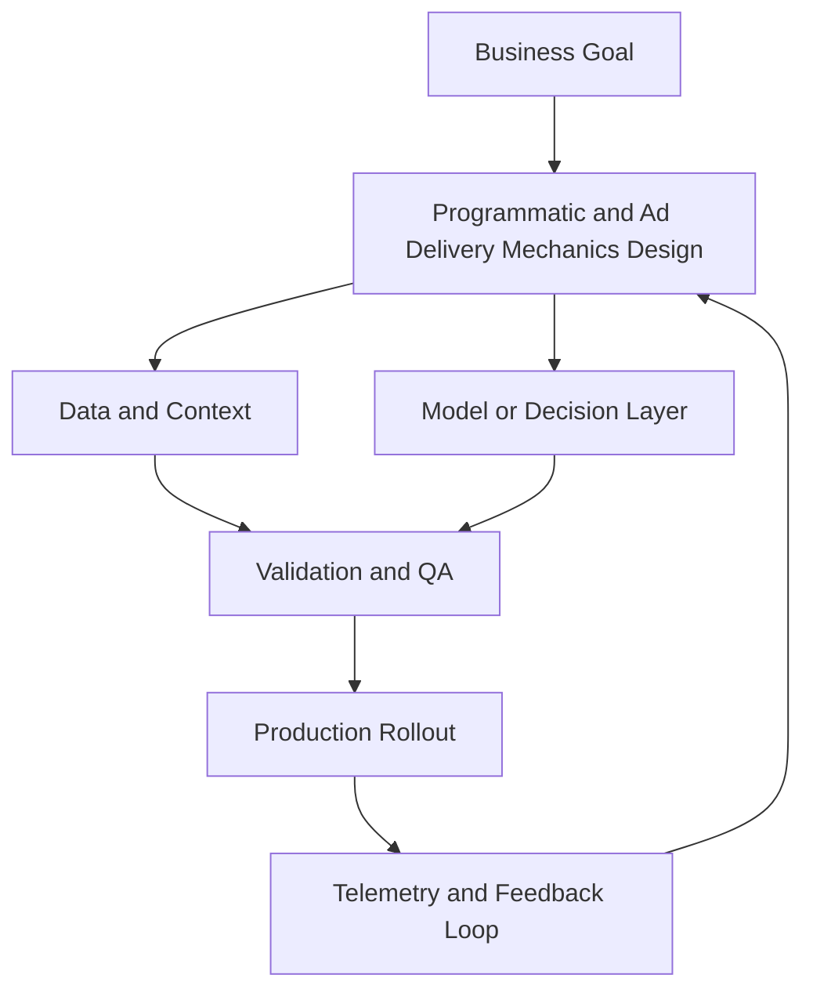

---

## 🏗️ Your Running Project

**What you're building:** You are building a full-funnel campaign for a SaaS product launch — from audience targeting to conversion measurement.
**What this module adds:** Build the programmatic pipes component.

> *Every decision here carries forward.*

# Programmatic and Ad Delivery Mechanics

## Summary

Understand bidstream fundamentals

## Outcomes

- Understand bidstream fundamentals
- Identify supply chain risk and fraud vectors
- Improve media quality controls
- Set a supply-path exclusion rule

## Theory

- DSP, SSP, exchange, and ad server roles
- OpenRTB, supply chain object, and seller transparency
- ads.txt and sellers.json as quality controls
- Auction mechanics, pacing, and bid shading
- Reseller chains and counterfeit inventory risk
- Path inspection before volume expansion

## Practical

- Trace one impression through the supply path
- Audit 5 domains for ads.txt coverage
- Inspect sellers.json and supply chain signals
- Design a quality floor for open exchange buys
- Write a stop-loss rule for poor inventory

## Tools

DV360, The Trade Desk, IAS, DoubleVerify

## Case Study

- **Protagonist:** Performance marketing lead
- **Context:** CPA worsened after scaling open exchange inventory.
- **Dilemma:** Keep scale or cut unknown supply paths and lose volume?
- **Options:**
  - Optimize bids only
  - Move budget to curated PMPs
  - Implement strict supply path optimization and quality floor
- **Recommendation:** Implement supply path optimization with a quality floor, then selectively reintroduce scale inventory.
- **Discussion questions:**
  - CPA is up after exchange expansion. Do you cut volume now or keep spend while tightening supply paths?
  - What hard quality threshold forces an immediate budget shift?
  - Do you block on missing ads.txt, opaque reseller chains, or both?
  - What evidence would make you restore spend?

<!-- VNEXT_AUGMENTATION -->
## vNext Lesson Augmentation

### Meme opener

### Quick Recap
- Start with a business outcome and measurable success criteria.
- Design the operating workflow before selecting tools.
- Add validation, observability, and rollback controls from day one.
- Use lightweight artifacts so decisions are auditable and repeatable.

### Concept Clarity
Think of this module like building a smart kitchen. The recipe (process), ingredients (data), and tasting checks (evaluation) matter more than buying the fanciest oven. If one part fails, you need a backup plan so dinner still gets served.

### System map (mermaid)

### Harvard-style case
**Case:** Programmatic and Ad Delivery Mechanics in a mid-market business unit.  
**Background:** Team needs faster execution without losing governance.  
**Complication:** Metrics are improving in pilots but unstable in production.  
**Analysis:** Missing control points (ownership, QA gates, and incident rules) increase variance.  
**Recommendation:** Introduce a phased operating model with explicit guardrails, then scale only when KPI and risk thresholds hold for two consecutive cycles.

### Primary references
- [NIST AI RMF](https://www.nist.gov/itl/ai-risk-management-framework)
- [Google SRE Workbook (SLOs)](https://sre.google/workbook/)
- [Harvard Business Review (Analytics & AI)](https://hbr.org/topic/analytics-and-ai)

### Downloadable artifacts
- [Module worksheet](/assets/courses/martech-adtech-academy/downloads/programmatic-pipes-worksheet.md)
- [Execution checklist (CSV)](/assets/courses/martech-adtech-academy/downloads/programmatic-pipes-checklist.csv)

### Media links
- [Module media list](/assets/courses/martech-adtech-academy/videos/programmatic-pipes-media.md)
- [MIT Sloan AI channel](https://www.youtube.com/@mitsloan)
- [Stanford HAI talks](https://www.youtube.com/@stanfordhai)

## 😄 Meme Opener

## Video Boosters
- **Quick Recap video:** [Watch](/assets/courses/martech-adtech-academy/videos/programmatic-pipes-quick-recap.mp4)
- **Concept Clarity video:** [Watch](/assets/courses/martech-adtech-academy/videos/programmatic-pipes-concept-clarity.mp4)

---

## 🎓 Harvard-Style Case Study — Programmatic brand safety and campaign setup controls

**Context:** A programmatic campaign ran for 3 weeks. 40% of impressions were served on brand-unsafe content. No brand safety controls had been set up.

**The tension:** Ship the campaign vs build the process control that prevents the failure.

**Decision options:**
1. Add brand safety controls before any programmatic campaign launches
2. add a brand safety audit to the campaign setup checklist
3. use an inclusion list of approved placements only

**Discussion questions:**
1. What signal would have caught this before it damaged the business?
2. Which option gives the best risk/effort tradeoff for a lean team?
3. Write a one-sentence policy that would prevent this failure mode.

---

## 🤖 Solo AI Discussion Prompt

**Red Team:** "You are reviewing this marketing decision. Find the top 2 ways it will fail and how to close those gaps."
