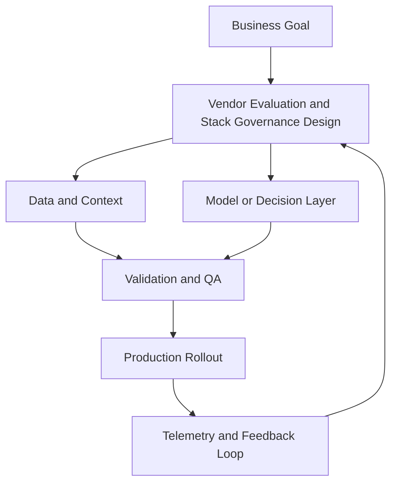

# Vendor Evaluation and Stack Governance

## Summary

Score vendors with defensible criteria

## Outcomes

- Score vendors with defensible criteria
- Model cost and lock-in risk
- Create governance for tool sprawl
- Protect high-value capabilities while cutting waste

## Theory

- TCO and switching cost analysis
- Security and procurement review
- Capability-maturity-aligned buying
- Scorecards that weight observability and control
- Exit planning and data portability
- Governance for adoption, renewal, and sunset

## Practical

- Build a weighted vendor scorecard
- Create a sunset plan for low-value tools
- Draft a governance charter
- Set the highest-weighted criteria
- Define one non-negotiable exit condition

## Tools

Airtable, Notion, Procurement templates

## Case Study

- **Protagonist:** COO
- **Context:** Board wants 30% SaaS cost reduction in 2 quarters.
- **Dilemma:** Cut tools quickly or preserve experimentation velocity?
- **Options:**
  - Immediate blanket reductions
  - Capability-based consolidation
  - Defer cuts pending revenue growth
- **Recommendation:** Capability-based consolidation with a protected innovation budget.
- **Discussion questions:**
  - You must cut 30% tooling cost in two quarters. Which capabilities are protected from cuts and why?
  - Which vendor do you sunset first, and what decision criteria make that defensible to the board?
  - Which criterion stays highest-weighted in your scorecard: integration complexity, data ownership, measurable incremental lift, or procurement cost?
  - What would fail first under that weighting?

<!-- VNEXT_AUGMENTATION -->
## vNext Lesson Augmentation

### Meme opener

### Quick Recap
- Start with a business outcome and measurable success criteria.
- Design the operating workflow before selecting tools.
- Add validation, observability, and rollback controls from day one.
- Use lightweight artifacts so decisions are auditable and repeatable.

### Concept Clarity
Think of this module like building a smart kitchen. The recipe (process), ingredients (data), and tasting checks (evaluation) matter more than buying the fanciest oven. If one part fails, you need a backup plan so dinner still gets served.

### System map (mermaid)

### Harvard-style case
**Case:** Vendor Evaluation and Stack Governance in a mid-market business unit.  
**Background:** Team needs faster execution without losing governance.  
**Complication:** Metrics are improving in pilots but unstable in production.  
**Analysis:** Missing control points (ownership, QA gates, and incident rules) increase variance.  
**Recommendation:** Introduce a phased operating model with explicit guardrails, then scale only when KPI and risk thresholds hold for two consecutive cycles.

### Primary references
- [NIST AI RMF](https://www.nist.gov/itl/ai-risk-management-framework)
- [Google SRE Workbook (SLOs)](https://sre.google/workbook/)
- [Harvard Business Review (Analytics & AI)](https://hbr.org/topic/analytics-and-ai)

### Downloadable artifacts
- [Module worksheet](/assets/courses/martech-adtech-academy/downloads/vendor-evaluation-worksheet.md)
- [Execution checklist (CSV)](/assets/courses/martech-adtech-academy/downloads/vendor-evaluation-checklist.csv)

### Media links
- [Module media list](/assets/courses/martech-adtech-academy/videos/vendor-evaluation-media.md)
- [MIT Sloan AI channel](https://www.youtube.com/@mitsloan)
- [Stanford HAI talks](https://www.youtube.com/@stanfordhai)

## 😄 Meme Opener

## Video Boosters
- **Quick Recap video:** [Watch](/assets/courses/martech-adtech-academy/videos/vendor-evaluation-quick-recap.mp4)
- **Concept Clarity video:** [Watch](/assets/courses/martech-adtech-academy/videos/vendor-evaluation-concept-clarity.mp4)
