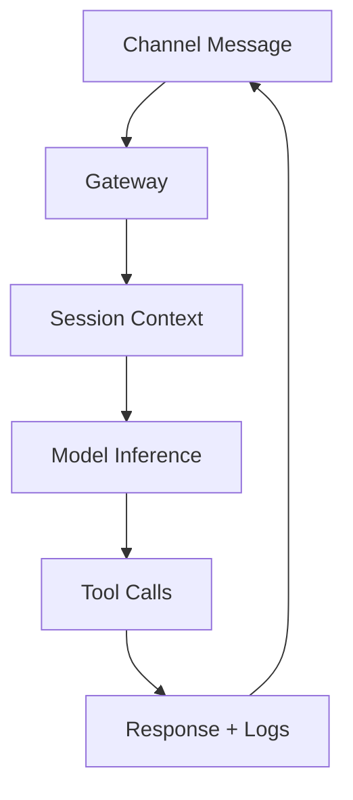

# Module Briefing: Security Model

**Meme opener:** "When someone says ‘it’s just a chatbot’ and you point at channels, sessions, tools, and policy layers."

## Quick Recap

- This module explains one OpenClaw subsystem and its operational tradeoffs.
- Learn where reliability, security, and developer speed can conflict.
- Prefer observable, reversible changes over brittle one-shot edits.

## Concept Clarity

OpenClaw is like a mission-control desk. Messages come in from many apps, one brain decides what to do, and tools act carefully with receipts.

## System sketch (mermaid)

## Case snapshot

A team running OpenClaw across Telegram and Discord sees rising load and intermittent tool timeouts. They add safer routing, tighter tool boundaries, and better runbook checkpoints before scaling.

## Primary references

- [Node.js child_process docs](https://nodejs.org/api/child_process.html)
- [OWASP Prompt Injection Cheat Sheet](https://cheatsheetseries.owasp.org/)
- [OpenClaw Gateway architecture docs](https://github.com/search?q=openclaw+gateway&type=repositories)

## Downloadable artifacts

- [Module Briefing Checklist](/assets/courses/openclaw-academy/module-briefing-checklist.md)
- [Scenario Worksheet](/assets/courses/openclaw-academy/scenario-worksheet.md)
- [Primary References](/assets/courses/openclaw-academy/primary-references.md)

## Media links

- [Agent architecture talks (YouTube)](https://www.youtube.com/results?search_query=agent+architecture+tool+use)
- [Production incident review examples](https://sre.google/workbook/postmortem-culture/)

## 😄 Meme Opener

## Video Boosters
- **Quick Recap video:** [Watch](/assets/courses/openclaw-academy/videos/module-06-security-quick-recap.mp4)
- **Concept Clarity video:** [Watch](/assets/courses/openclaw-academy/videos/module-06-security-concept-clarity.mp4)

---

## 🎓 Harvard-Style Case Study — Security — Compromise

**Context:** A trusted user account is compromised. The attacker uses the trusted permissions to extract conversation history and invoke tools.

**The tension:** Move fast vs build observability and resilience from the start.

**Decision options:**
1. Add anomaly detection on trusted-user behaviour
2. add session audit logging
3. add 2FA for elevated trust levels.

**Discussion questions:**
1. At what team size or usage scale does this become a critical priority rather than a nice-to-have?
2. What is the minimum viable version of each option for a one-person team?
3. Write a one-line checklist item that captures this lesson for future deployments.

---

## 🤖 Solo AI Discussion Prompt

**Mentor Mode (Beginner):** "I am new to OpenClaw operations. Explain this scenario in simple terms, then walk me through which option you'd recommend for a small team and why."
