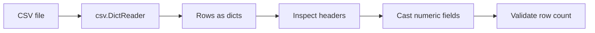

## CSV: The Most Common Interview Data Format

They almost always give you CSV. It's simple to reason about, easy to generate test data for, and reveals instantly whether you know your stdlib.

> 🤔 **Before reading on:**
>
> - What module do you import?
> - What's the difference between `csv.reader` and `csv.DictReader`?
> - If a field says `"8.42"` in the CSV, what type is it in Python?

---

## The Pattern

```python
import csv
from pathlib import Path

def load_csv(filepath: str) -> list[dict]:
    path = Path(filepath)
    with open(path, newline="") as f:
        reader = csv.DictReader(f)
        return list(reader)
```

**`newline=""`** — always pass this to `open()` when reading CSV. It prevents `\r\n` issues on Windows files.

**`csv.DictReader`** — each row becomes a dict keyed by the header row. Far cleaner than `csv.reader` which gives you a list of values.

## The Type Problem

```python
rows = load_csv("results.csv")
print(rows[0])
# {'model': 'gpt-4o', 'quality_score': '8.42', 'cost': '0.025'}
#                                          ^^^^^ still a string!
```

You must cast:
```python
score = float(row["quality_score"])
cost  = float(row["cost"])
```

Interviewers watch for this. Failing to cast and then wondering why `"8.42" > "9.1"` evaluates to `True` is a red flag.

---

## Visual Workflow



## What Eli Is Listening For

- You choose `csv.DictReader` when headers exist.
- You remember CSV values arrive as strings.
- You inspect headers before assuming field names.
- You cast only the fields that should be numeric.

