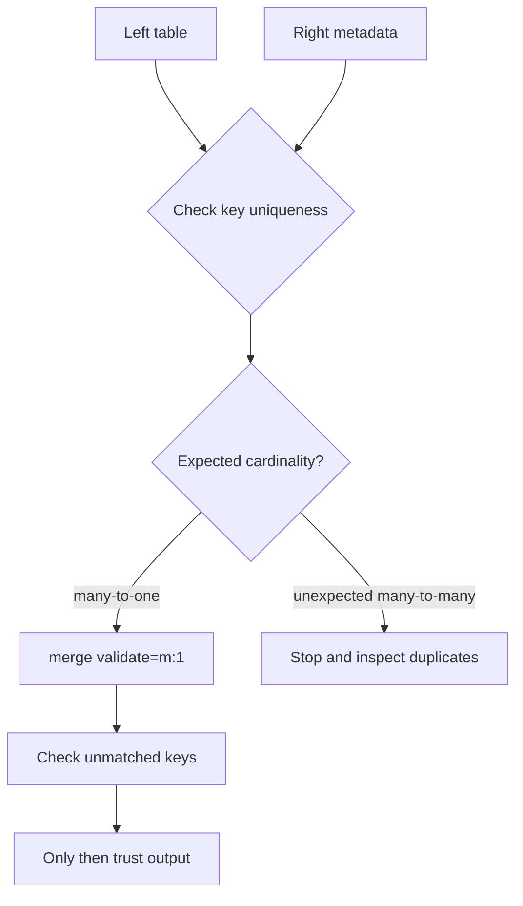

## Join Carefully, Not Hopefully

> 🤔 Think it through:
> - Is the right-hand table one row per model_id?
> - How will you spot keys that did not match?
> - What validate=... setting matches the real relationship?

## The Pattern

```python
import pandas as pd


def enrich(results: pd.DataFrame, models: pd.DataFrame) -> pd.DataFrame:
    merged = results.merge(
        models,
        on="model_id",
        how="left",
        validate="many_to_one",
        indicator=True,
    )

    print(merged["_merge"].value_counts())
    print(merged[merged["_merge"] != "both"])
    return merged.drop(columns=["_merge"])
```

## Narration

"I’m going to check the key cardinality before I trust the merge. validate='many_to_one' makes the assumption explicit, and indicator=True tells me right away if any rows missed the metadata table."

## Your Mission

Enrich the benchmark results with model metadata and prove the join did not duplicate or drop rows unexpectedly.

---

## Visual Workflow



## What Eli Is Listening For

- You inspect join keys before merging.
- You name the expected cardinality.
- You check unmatched rows after the merge.
- You treat row multiplication as a bug until proven otherwise.

