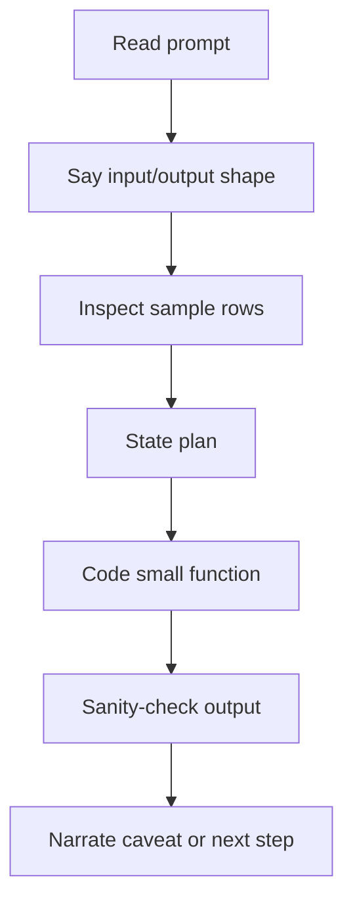

## The 8 Narration Patterns

> 🤔 Think it through:
> - Which sentence helps the interviewer follow your reasoning?
> - When should you narrate the trade-off instead of the code?
> - How do you stay useful while you are still thinking?

1. **Shape first** , “I’ll inspect the shape, columns, and dtypes first so I know what I’m actually working with.” Use this when the data is unfamiliar.

2. **Define the metric in words** , “I’ll define the metric in words before I implement the formula, just to avoid a units mistake.” Use this before writing TTFT, throughput, or pricing logic.

3. **Check join uniqueness** , “I’m going to check whether this key is unique before I trust the merge.” Use this anytime two tables meet.

4. **Handle nulls explicitly** , “I see missing values here, so I’ll decide explicitly whether they should be excluded, filled, or surfaced.” Use this when pandas defaults could hide data.

5. **Two-pass solve** , “I’ll solve this in two passes: first get the correct intermediate table, then format the final output.” Use this when correctness and presentation are both part of the task.

6. **Stdlib vs pandas** , “For a small file I could use the standard library, but since we want grouped summaries quickly, pandas is the cleaner choice here.” Use this when the interviewer is testing judgment, not library loyalty.

7. **Add a sanity check** , “I’m adding a quick sanity check so I can verify the aggregate matches the underlying rows.” Use this after merges, groupbys, and filters.

8. **Keep the hardening note in reserve** , “If I were hardening this beyond the interview, I’d add join validation and a couple of edge-case tests, but I’ll keep the live version focused.” Use this to show production thinking without derailing the solution.

## Your Mission

Read the eight narration patterns, then practise saying them out loud while you work through a problem.

---

## Visual Workflow

## What Eli Is Listening For

- You narrate uncertainty instead of going silent.
- You state assumptions before they affect code.
- You explain checks in plain English.
- You can recover from a bug calmly and specifically.

