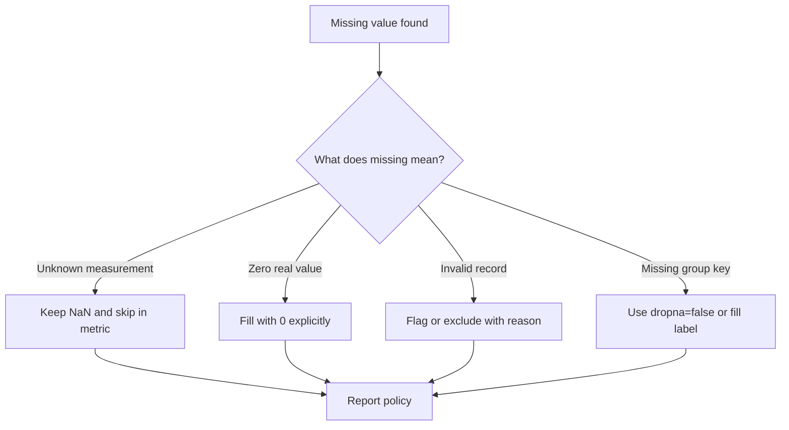

## Missing Values Need a Policy

> 🤔 Think it through:
> - Should missing scores be excluded, filled, or surfaced?
> - What does skipna=True do by default in aggregations?
> - Do you want NaN categories to appear as their own group?

## The Pattern

```python
import pandas as pd


def summarise_nulls(df: pd.DataFrame) -> pd.DataFrame:
    missing = df.isna().sum().to_frame(name="missing_count")
    df = df.copy()
    df["quality_score"] = df["quality_score"].fillna(0)
    summary = df.groupby("provider", dropna=False)["quality_score"].median()
    return missing.join(summary.rename("median_quality"), how="left")
```

## Narration

"I’m going to decide what missing means before I aggregate. If a null should stay visible, I’ll surface it with dropna=False instead of letting pandas quietly drop the group."

## Your Mission

Show how you would surface missing values, choose a fill policy only when it is justified, and keep missing groups visible in summaries.

---

## Visual Workflow



## What Eli Is Listening For

- You ask what null means before choosing a policy.
- You do not silently turn missing latency into zero.
- You preserve missing group keys when they matter.
- You report how many rows were affected.

