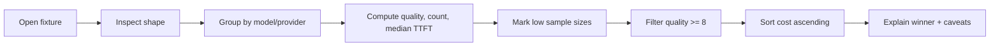

## Timed Interview Room: 20 Minutes

Treat this like a real screen-share. Open the drill pack fixture, inspect the records, then build the smallest useful summary.

**Files:**

- `downloads/python-interview-prep-drill-pack/fixtures/sample_results.json`
- Compare only at the end with `expected_outputs/provider_groupby.expected.csv` and `expected_outputs/blended_price.expected.json`

## Candidate Prompt

You have a JSON file of LLM benchmark results. Each record has `model`, `provider`, `task`, `quality_score`, nullable `ttft_ms`, `cost_per_1k_tokens`, and token counts.

Produce:

1. A ranked summary table by model or provider, sorted by average quality descending.
2. Median TTFT, preserving the fact that some TTFT values are null.
3. The cheapest model with average quality >= 8.0.
4. A `(*)` marker for any model with fewer than 10 results.

## Starter Signature

```python
def benchmark_summary(path: str) -> tuple[object, object]:
    """Return (ranked_table, cheapest_above_threshold)."""
```

## Checkpoints

- **Minute 0–3:** Restate output shape; inspect `type(data)`, `len(data)`, first row, and keys.
- **Minute 3–8:** Load into a DataFrame or explicit buckets. Name the denominator for every metric.
- **Minute 8–14:** Aggregate, sort, mark low sample sizes, and find cheapest-above-threshold.
- **Minute 14–18:** Sanity-check one model by hand.
- **Minute 18–20:** Explain assumptions, null policy, and the biggest remaining risk.

## Common Bugs

- Sorting costs before filtering quality >= 8.0.
- Rounding quality before ranking, changing ties.
- Treating null TTFT as zero instead of leaving it missing.
- Forgetting that fewer than 10 rows is a confidence warning, not a failure.

## Interviewer Rubric

| Signal | Strong answer |
|---|---|
| Shape inspection | Checks fields and sample rows before aggregation |
| Metric correctness | Uses average quality, median TTFT, count, and cost clearly |
| Edge policy | States null TTFT and low-sample policy |
| Output quality | Sorted table with readable columns and deterministic ties |
| Narration | Explains filter → sort → first for cheapest model |

## Your Mission

In the answer box, describe your approach before coding: what you inspect, how you aggregate, how you handle null TTFT, and how you find the cheapest model above threshold.

Eli will push on gaps for the first two attempts. On attempt three, he reveals the full pattern.

---

## Visual Workflow



## What Eli Is Listening For

- You inspect the data before aggregating.
- You handle nullable TTFT without pretending it is zero.
- You filter by quality before choosing cheapest.
- You explain low sample size as confidence risk.

