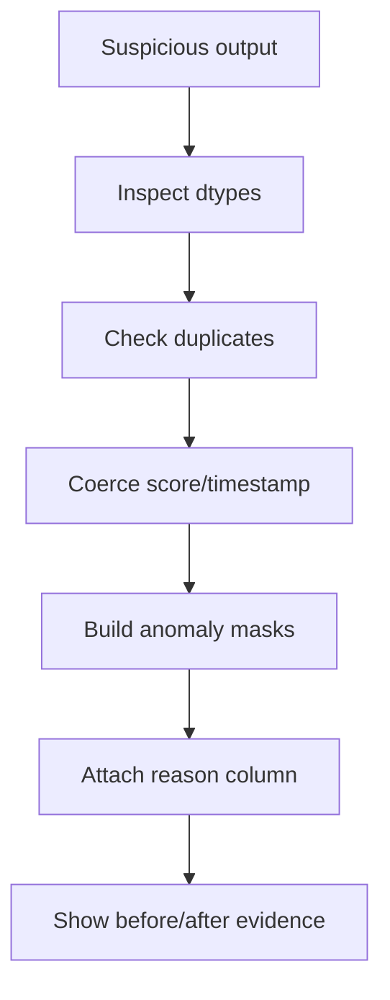

## Timed Interview Room: 45 Minutes

Debugging interviews measure discipline. The table is almost right, which is more dangerous than obviously broken code.

**Files:**

- `downloads/python-interview-prep-drill-pack/fixtures/messy_scores.csv`
- Expected anomaly report: `downloads/python-interview-prep-drill-pack/expected_outputs/anomaly_flags.expected.csv`

## Candidate Prompt

You inherit a script that ranks model scores, but the final table looks suspicious: one toy model is at the top, one model has no score, and duplicate run IDs appear in the raw file.

Find the root causes, explain them, and produce an anomaly report with a human-readable reason for each suspicious row.

## Starter Signature

```python
def anomaly_flags(path: str) -> pandas.DataFrame:
    ...
```

## Debugging Workflow

```python
import pandas as pd


def inspect_first(df: pd.DataFrame) -> None:
    print(df.head())
    print(df.info())
    print(df.dtypes)
    print(df["run_id"].duplicated().sum())
```

Then coerce deliberately:

```python
score = pd.to_numeric(df["score"], errors="coerce")
submitted_at = pd.to_datetime(df["submitted_at"], errors="coerce", utc=True)
```

## Checkpoints

- **Minute 0–5:** Inspect rows, dtypes, duplicates, nulls.
- **Minute 5–15:** List possible root causes before editing code.
- **Minute 15–25:** Add coercion and explicit anomaly masks.
- **Minute 25–35:** Produce a reason column without deleting rows first.
- **Minute 35–45:** Prove the fix with counts and explain the minimal change.

## Common Bugs

- Sorting score strings lexicographically instead of numerically.
- Dropping rows before recording why they were suspicious.
- Treating an outlier score like `1000` as valid because it is numeric.
- Fixing duplicates without saying whether you keep first, latest, or max score.

## Interviewer Rubric

| Signal | Strong answer |
|---|---|
| Diagnosis | Checks dtypes, duplicates, nulls, and sample rows first |
| Root cause | Explains string scores, invalid timestamps, duplicates, and outliers |
| Minimal fix | Uses coercion and masks, not a full rewrite |
| Evidence | Shows before/after counts or anomaly table |
| Narration | Names the risk of silently dropping rows |

## Your Mission

Describe your debugging plan: what you inspect first, which root causes you test, how you build the anomaly report, and how you prove the fix works.

---

## Visual Workflow



## What Eli Is Listening For

- You diagnose before rewriting.
- You prove whether scores are numeric.
- You preserve suspicious rows with reasons.
- You show evidence that the fix changed the right thing.

