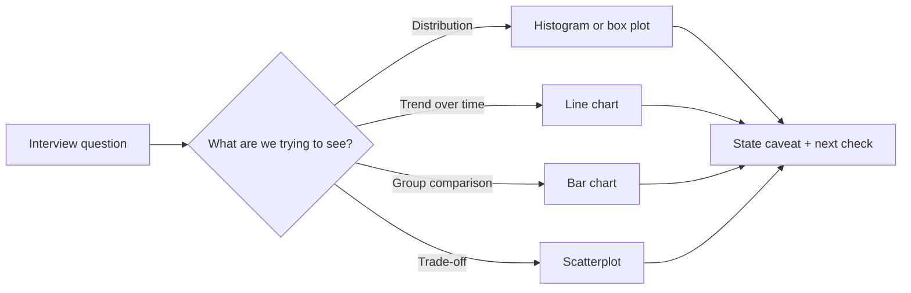

## Why This Matters in Interviews

A data-heavy Python interview often gives you a messy table and asks what you notice. A strong answer is not just code. It is: inspect, visualise, explain, then verify.

> 🤔 Think it through:
> - Are you trying to compare groups, inspect a distribution, show a trend, or expose a trade-off?
> - Which chart would make the answer obvious to a non-Python reviewer?
> - What caveat would you say out loud?

## The Pattern

```python
import matplotlib.pyplot as plt


def plot_latency_distribution(df):
    ax = df["latency_ms"].hist(bins=20)
    ax.set_title("Latency distribution")
    ax.set_xlabel("Latency (ms)")
    ax.set_ylabel("Request count")
    return ax


def plot_quality_cost_tradeoff(df):
    ax = df.plot.scatter(x="cost_per_1k", y="quality_score", c="p95_latency_ms", colormap="viridis")
    ax.set_title("Quality vs cost, coloured by p95 latency")
    return ax
```

## Narration

"I’d start with a histogram to see whether latency is normally distributed or tail-heavy. Then I’d use a scatterplot for quality versus cost, because the interview question is really about trade-offs, not just the single top score."

## Your Mission

Given a dataset summary, choose the chart type, the columns, and the interview narration you would use.

---

## Visual Workflow



## What Eli Is Listening For

- You choose the chart based on the analytical question, not habit.
- You label units and axes explicitly.
- You mention outliers, denominators, and sample size.
- You explain what the visual suggests and what still needs verification.
