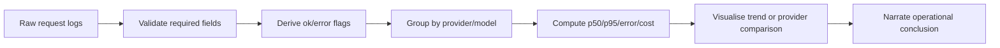

## Telemetry Is Interview Gold

Telemetry problems test whether you can turn noisy operational data into a clear answer. You are not just counting rows; you are explaining whether the system is healthy.

> 🤔 Think it through:
> - What is the unit of observation: request, session, model call, or user?
> - Which fields prove success, failure, latency, and cost?
> - Are missing spans real failures or instrumentation gaps?

## The Pattern

```python
def summarize_telemetry(df):
    df = df.copy()
    df["ok"] = df["status_code"].between(200, 299)

    return (
        df.groupby("provider")
        .agg(
            requests=("request_id", "count"),
            error_rate=("ok", lambda s: 1 - s.mean()),
            p50_latency_ms=("latency_ms", "median"),
            p95_latency_ms=("latency_ms", lambda s: s.quantile(0.95)),
            total_cost_usd=("cost_usd", "sum"),
        )
        .reset_index()
    )
```

## Narration

"I’ll group by provider because the operational question is provider reliability. I’ll report p95 instead of only mean latency because interviewers care about tail experience. I’ll also flag missing span IDs separately so we do not confuse observability gaps with product failures."

## Your Mission

Design a telemetry summary for model calls: what metrics, groupings, caveats, and chart would you present?

---

## Visual Workflow



## What Eli Is Listening For

- You distinguish telemetry from benchmark datasets.
- You compute tail latency, not just averages.
- You call out missing or malformed instrumentation.
- You connect metrics to an operational decision.
