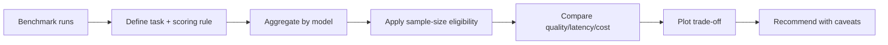

## Benchmarking Is Structured Comparison

In AI/ML interviews, a benchmark answer should sound like a small evaluation report. You define the task, compute comparable metrics, visualise the trade-off, and make a recommendation with caveats.

> 🤔 Think it through:
> - What task are you benchmarking?
> - Is the sample size large enough to trust?
> - Is the winner still a winner under latency or cost constraints?

## The Pattern

```python
def benchmark_scorecard(df):
    grouped = (
        df.groupby("model")
        .agg(
            n=("task_id", "count"),
            accuracy=("passed", "mean"),
            avg_score=("score", "mean"),
            p95_latency_ms=("latency_ms", lambda s: s.quantile(0.95)),
            avg_cost_usd=("cost_usd", "mean"),
        )
        .reset_index()
    )
    grouped["eligible"] = grouped["n"] >= 30
    return grouped.sort_values(["eligible", "accuracy", "p95_latency_ms", "avg_cost_usd"], ascending=[False, False, True, True])
```

## Narration

"I would not pick the highest score blindly. First I’d filter for enough samples, then compare accuracy against p95 latency and cost. If two models are close on quality, I’d recommend the lower-latency or lower-cost option depending on the product constraint."

## Your Mission

Build a benchmark scorecard plan: metrics, eligibility threshold, visualisation, and final recommendation rule.

---

## Visual Workflow



## What Eli Is Listening For

- You make task definition and sample size explicit.
- You compare quality with latency and cost, not in isolation.
- You choose a visual that reveals the trade-off.
- You make a recommendation that depends on constraints.
