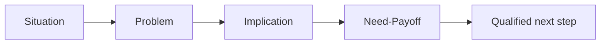

# SPIN Foundations: Core Concepts

## 😄 Meme Opener (cognitive ease)
**Meme concept:** "When the prospect says 'sounds good' and you mark it Commit without an Economic Buyer call."  
**Why this hurts in real life:** optimistic signals are not decision evidence.

## Quick Recap
- This module teaches the minimum evidence required to move a deal safely.
- Use the checklist below before advancing stage.
- Treat uncertainty as a work item, not a hope statement.

## Concept Clarity
Imagine a deal like crossing a river with stepping stones.  
SPIN helps you find where the stones are, MEDDIC checks whether each stone can hold your weight.  
If one is missing, you do not jump and pray, you place the stone first.

## Mermaid Visual

## Harvard-Style Case
### Case: SPIN discovery quality lift in enterprise SaaS
**Context:** Reps were leading with feature demos before surfacing business pain.

**Decision point:** Rebuild discovery around SPIN or keep product-first calls for speed?

**Options considered:**
- Keep product-first and shorten calls
- Adopt SPIN call structure with implication and need-payoff depth
- Outsource discovery to junior SDR-only handoff

**Action taken:** Adopted SPIN call guides and manager call reviews focused on implication quality.

**Outcome:** Better buyer alignment and fewer stalled opportunities after demo.

**What we'd do differently:** Instrument call-score telemetry earlier to coach reps faster.

**Discussion questions:**
1. Which SPIN step was the strongest leverage point?
2. What signal proves implication questions are working?

**Sources:**
- https://www.salesforce.com/blog/spin-selling/
- https://www.close.com/blog/spin-selling

## Primary References
- https://www.huthwaiteinternational.com/spin-selling/
- https://www.salesforce.com/blog/spin-selling/

**Source quality note:** prioritize primary company/institution sources over commentary when updating this module.

## Execution Checklist
1. Confirm the real business pain in buyer language.
2. Quantify implication (cost, delay, risk, or lost revenue).
3. Validate stakeholder roles and decision path.
4. Define next step with owner, date, and proof target.

## Concept Clarity + TLDR Video Placeholders
- **Concept Clarity video:** [Watch](/assets/courses/sales-spin-meddic/videos/02-spin-foundations-eli5.mp4)
- **Quick Recap video:** [Watch](/assets/courses/sales-spin-meddic/videos/02-spin-foundations-tldr.mp4)

## Downloadable Practical Artifacts
- [SPIN Discovery Template](/assets/courses/sales-spin-meddic/downloads/spin-discovery-template.md)
- [Stakeholder Map Template](/assets/courses/sales-spin-meddic/downloads/stakeholder-map-template.md)
- [MEDDIC Scorecard Template (CSV)](/assets/courses/sales-spin-meddic/downloads/meddic-scorecard-template.csv)
- [MEDDIC Filled Example (CSV)](/assets/courses/sales-spin-meddic/downloads/meddic-scorecard-filled-example.csv)
- [Forecast Confidence Rubric](/assets/courses/sales-spin-meddic/downloads/forecast-confidence-rubric.md)
- [Deal Room Checklist](/assets/courses/sales-spin-meddic/downloads/deal-room-checklist.md)

## Anti-Pattern to Avoid
Do not let strong rapport replace qualification evidence.
