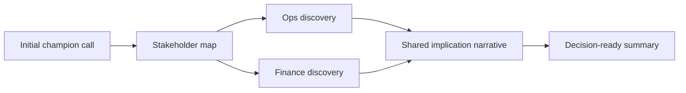

---

## 🏗️ Your Running Project

**What you're building:** You are closing a $250k enterprise deal using SPIN, MEDDIC, and Challenger selling — from discovery to signed contract.
**What this module adds:** Build the 03 spin live discovery component.

> *Every decision here carries forward.*

# SPIN in Live Discovery: Core Concepts

## 😄 Meme Opener (cognitive ease)
**Meme concept:** "When the prospect says 'sounds good' and you mark it Commit without an Economic Buyer call."  
**Why this hurts in real life:** optimistic signals are not decision evidence.

## Quick Recap
- This module teaches the minimum evidence required to move a deal safely.
- Use the checklist below before advancing stage.
- Treat uncertainty as a work item, not a hope statement.

## Concept Clarity
Imagine a deal like crossing a river with stepping stones.  
SPIN helps you find where the stones are, MEDDIC checks whether each stone can hold your weight.  
If one is missing, you do not jump and pray, you place the stone first.

## Mermaid Visual

## Harvard-Style Case
### Case: Live discovery rescue on multi-stakeholder SaaS deal
**Context:** Champion was engaged, but finance and operations concerns were unknown.

**Decision point:** Advance to proposal or run deeper multi-thread discovery?

**Options considered:**
- Send pricing immediately
- Run stakeholder-specific SPIN follow-up sessions
- Wait for inbound questions only

**Action taken:** Ran role-specific SPIN follow-ups and documented cross-functional implications.

**Outcome:** Stronger consensus and clearer close plan with fewer surprise objections.

**What we'd do differently:** Schedule economic buyer conversation one stage earlier.

**Discussion questions:**
1. What stakeholder gap created the highest risk?
2. Which implication question unlocked urgency?

**Sources:**
- https://www.salesforce.com/blog/spin-selling/
- https://www.close.com/blog/spin-selling

## Primary References
- https://www.huthwaiteinternational.com/spin-selling/
- https://www.gong.io/blog/

**Source quality note:** prioritize primary company/institution sources over commentary when updating this module.

## Execution Checklist
1. Confirm the real business pain in buyer language.
2. Quantify implication (cost, delay, risk, or lost revenue).
3. Validate stakeholder roles and decision path.
4. Define next step with owner, date, and proof target.

## Concept Clarity + TLDR Video Placeholders
- **Concept Clarity video:** [Watch](/assets/courses/sales-spin-meddic/videos/03-spin-live-discovery-eli5.mp4)
- **Quick Recap video:** [Watch](/assets/courses/sales-spin-meddic/videos/03-spin-live-discovery-tldr.mp4)

## Downloadable Practical Artifacts
- [SPIN Discovery Template](/assets/courses/sales-spin-meddic/downloads/spin-discovery-template.md)
- [Stakeholder Map Template](/assets/courses/sales-spin-meddic/downloads/stakeholder-map-template.md)
- [MEDDIC Scorecard Template (CSV)](/assets/courses/sales-spin-meddic/downloads/meddic-scorecard-template.csv)
- [MEDDIC Filled Example (CSV)](/assets/courses/sales-spin-meddic/downloads/meddic-scorecard-filled-example.csv)
- [Forecast Confidence Rubric](/assets/courses/sales-spin-meddic/downloads/forecast-confidence-rubric.md)
- [Deal Room Checklist](/assets/courses/sales-spin-meddic/downloads/deal-room-checklist.md)

## Anti-Pattern to Avoid
Do not let strong rapport replace qualification evidence.
