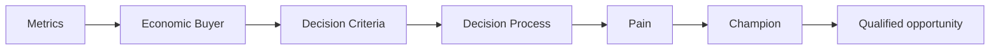

# MEDDIC Fundamentals: Core Concepts

## 😄 Meme Opener (cognitive ease)
**Meme concept:** "When the prospect says 'sounds good' and you mark it Commit without an Economic Buyer call."  
**Why this hurts in real life:** optimistic signals are not decision evidence.

## Quick Recap
- This module teaches the minimum evidence required to move a deal safely.
- Use the checklist below before advancing stage.
- Treat uncertainty as a work item, not a hope statement.

## Concept Clarity
Imagine a deal like crossing a river with stepping stones.  
SPIN helps you find where the stones are, MEDDIC checks whether each stone can hold your weight.  
If one is missing, you do not jump and pray, you place the stone first.

## Mermaid Visual

## Harvard-Style Case
### Case: PTC-style qualification discipline in enterprise deals
**Context:** Team had pipeline coverage but poor forecast reliability.

**Decision point:** Continue rep-led intuition forecasting or enforce MEDDIC evidence gates?

**Options considered:**
- Trust rep confidence notes
- Require MEDDIC evidence before commit category
- Increase top-of-funnel spend to hide forecast misses

**Action taken:** Rolled out MEDDIC inspections with explicit evidence per deal stage.

**Outcome:** Improved deal qualification consistency and clearer risk identification.

**What we'd do differently:** Improve champion validation quality, not just champion presence.

**Discussion questions:**
1. Which MEDDIC element is most often faked in pipeline reviews?
2. What evidence should be non-negotiable before commit?

**Sources:**
- https://www.mural.co/blog/meddic-sales-methodology
- https://meddicc.com/use-case

## Primary References
- https://meddicc.com/
- https://www.ptc.com/en/investor-relations

**Source quality note:** prioritize primary company/institution sources over commentary when updating this module.

## Execution Checklist
1. Confirm the real business pain in buyer language.
2. Quantify implication (cost, delay, risk, or lost revenue).
3. Validate stakeholder roles and decision path.
4. Define next step with owner, date, and proof target.

## Concept Clarity + TLDR Video Placeholders
- **Concept Clarity video:** [Watch](/assets/courses/sales-spin-meddic/videos/04-meddic-fundamentals-eli5.mp4)
- **Quick Recap video:** [Watch](/assets/courses/sales-spin-meddic/videos/04-meddic-fundamentals-tldr.mp4)

## Downloadable Practical Artifacts
- [SPIN Discovery Template](/assets/courses/sales-spin-meddic/downloads/spin-discovery-template.md)
- [Stakeholder Map Template](/assets/courses/sales-spin-meddic/downloads/stakeholder-map-template.md)
- [MEDDIC Scorecard Template (CSV)](/assets/courses/sales-spin-meddic/downloads/meddic-scorecard-template.csv)
- [MEDDIC Filled Example (CSV)](/assets/courses/sales-spin-meddic/downloads/meddic-scorecard-filled-example.csv)
- [Forecast Confidence Rubric](/assets/courses/sales-spin-meddic/downloads/forecast-confidence-rubric.md)
- [Deal Room Checklist](/assets/courses/sales-spin-meddic/downloads/deal-room-checklist.md)

## Anti-Pattern to Avoid
Do not let strong rapport replace qualification evidence.
