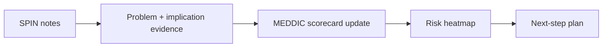

# SPIN to MEDDIC Handoff: Core Concepts

## 😄 Meme Opener (cognitive ease)
**Meme concept:** "When the prospect says 'sounds good' and you mark it Commit without an Economic Buyer call."  
**Why this hurts in real life:** optimistic signals are not decision evidence.

## Quick Recap
- This module teaches the minimum evidence required to move a deal safely.
- Use the checklist below before advancing stage.
- Treat uncertainty as a work item, not a hope statement.

## Concept Clarity
Imagine a deal like crossing a river with stepping stones.  
SPIN helps you find where the stones are, MEDDIC checks whether each stone can hold your weight.  
If one is missing, you do not jump and pray, you place the stone first.

## Mermaid Visual

## Harvard-Style Case
### Case: Discovery-to-qualification conversion play
**Context:** Discovery notes existed, but qualification fields stayed shallow.

**Decision point:** Keep separate note systems or force SPIN-to-MEDDIC mapping step?

**Options considered:**
- Leave notes unstructured
- Map SPIN outputs into MEDDIC fields with owner/date
- Rely on manager interpretation each week

**Action taken:** Introduced handoff checklist converting call evidence into MEDDIC scorecard updates.

**Outcome:** Reduced information loss and improved pipeline inspection speed.

**What we'd do differently:** Automate scorecard updates from call summaries where possible.

**Discussion questions:**
1. Where does information decay most between calls and forecast?
2. How do you test if a champion claim is real?

**Sources:**
- https://www.salesforce.com/blog/spin-selling/
- https://www.mural.co/blog/meddic-sales-methodology

## Primary References
- https://meddicc.com/
- https://www.huthwaiteinternational.com/spin-selling/

**Source quality note:** prioritize primary company/institution sources over commentary when updating this module.

## Execution Checklist
1. Confirm the real business pain in buyer language.
2. Quantify implication (cost, delay, risk, or lost revenue).
3. Validate stakeholder roles and decision path.
4. Define next step with owner, date, and proof target.

## Concept Clarity + TLDR Video Placeholders
- **Concept Clarity video:** [Watch](/assets/courses/sales-spin-meddic/videos/05-spin-to-meddic-eli5.mp4)
- **Quick Recap video:** [Watch](/assets/courses/sales-spin-meddic/videos/05-spin-to-meddic-tldr.mp4)

## Downloadable Practical Artifacts
- [SPIN Discovery Template](/assets/courses/sales-spin-meddic/downloads/spin-discovery-template.md)
- [Stakeholder Map Template](/assets/courses/sales-spin-meddic/downloads/stakeholder-map-template.md)
- [MEDDIC Scorecard Template (CSV)](/assets/courses/sales-spin-meddic/downloads/meddic-scorecard-template.csv)
- [MEDDIC Filled Example (CSV)](/assets/courses/sales-spin-meddic/downloads/meddic-scorecard-filled-example.csv)
- [Forecast Confidence Rubric](/assets/courses/sales-spin-meddic/downloads/forecast-confidence-rubric.md)
- [Deal Room Checklist](/assets/courses/sales-spin-meddic/downloads/deal-room-checklist.md)

## Anti-Pattern to Avoid
Do not let strong rapport replace qualification evidence.
