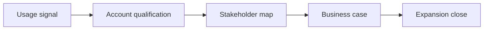

---

## 🏗️ Your Running Project

**What you're building:** You are closing a $250k enterprise deal using SPIN, MEDDIC, and Challenger selling — from discovery to signed contract.
**What this module adds:** Build the 06 growth wins component.

> *Every decision here carries forward.*

# Growth Case Studies: Success Patterns: Core Concepts

## 😄 Meme Opener (cognitive ease)
**Meme concept:** "When the prospect says 'sounds good' and you mark it Commit without an Economic Buyer call."  
**Why this hurts in real life:** optimistic signals are not decision evidence.

## Quick Recap
- This module teaches the minimum evidence required to move a deal safely.
- Use the checklist below before advancing stage.
- Treat uncertainty as a work item, not a hope statement.

## Concept Clarity
Imagine a deal like crossing a river with stepping stones.  
SPIN helps you find where the stones are, MEDDIC checks whether each stone can hold your weight.  
If one is missing, you do not jump and pray, you place the stone first.

## Mermaid Visual

## Harvard-Style Case
### Case: Dropbox and Zoom: usage-to-revenue conversion patterns
**Context:** High usage growth did not automatically produce enterprise conversion.

**Decision point:** Double down on self-serve or build qualification overlays for expansion?

**Options considered:**
- Stay pure self-serve
- Add expansion qualification and buyer mapping
- Increase discounts to force conversion

**Action taken:** Added sales motion on top of usage signals for higher-value conversions.

**Outcome:** Stronger expansion pipeline quality and better conversion efficiency.

**What we'd do differently:** Segment activation thresholds by persona sooner.

**Discussion questions:**
1. Which growth signal is most predictive of expansion readiness?
2. What qualification step prevents false positives from vanity usage?

**Sources:**
- https://openviewpartners.com/blog/going-viral-how-dropbox-used-a-product-led-growth-strategy-to-hit-10b-in-only-10-years/
- https://www.zuora.com/our-customers/case-studies/zoom/

## Primary References
- https://investors.zoom.us/
- https://investors.dropbox.com/

**Source quality note:** prioritize primary company/institution sources over commentary when updating this module.

## Execution Checklist
1. Confirm the real business pain in buyer language.
2. Quantify implication (cost, delay, risk, or lost revenue).
3. Validate stakeholder roles and decision path.
4. Define next step with owner, date, and proof target.

## Concept Clarity + TLDR Video Placeholders
- **Concept Clarity video:** [Watch](/assets/courses/sales-spin-meddic/videos/06-growth-wins-eli5.mp4)
- **Quick Recap video:** [Watch](/assets/courses/sales-spin-meddic/videos/06-growth-wins-tldr.mp4)

## Downloadable Practical Artifacts
- [SPIN Discovery Template](/assets/courses/sales-spin-meddic/downloads/spin-discovery-template.md)
- [Stakeholder Map Template](/assets/courses/sales-spin-meddic/downloads/stakeholder-map-template.md)
- [MEDDIC Scorecard Template (CSV)](/assets/courses/sales-spin-meddic/downloads/meddic-scorecard-template.csv)
- [MEDDIC Filled Example (CSV)](/assets/courses/sales-spin-meddic/downloads/meddic-scorecard-filled-example.csv)
- [Forecast Confidence Rubric](/assets/courses/sales-spin-meddic/downloads/forecast-confidence-rubric.md)
- [Deal Room Checklist](/assets/courses/sales-spin-meddic/downloads/deal-room-checklist.md)

## Anti-Pattern to Avoid
Do not let strong rapport replace qualification evidence.
