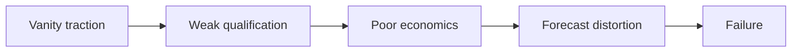

---

## 🏗️ Your Running Project

**What you're building:** You are closing a $250k enterprise deal using SPIN, MEDDIC, and Challenger selling — from discovery to signed contract.
**What this module adds:** Build the 07 failure postmortems component.

> *Every decision here carries forward.*

# Failure Case Studies: What Broke: Core Concepts

## 😄 Meme Opener (cognitive ease)
**Meme concept:** "When the prospect says 'sounds good' and you mark it Commit without an Economic Buyer call."  
**Why this hurts in real life:** optimistic signals are not decision evidence.

## Quick Recap
- This module teaches the minimum evidence required to move a deal safely.
- Use the checklist below before advancing stage.
- Treat uncertainty as a work item, not a hope statement.

## Concept Clarity
Imagine a deal like crossing a river with stepping stones.  
SPIN helps you find where the stones are, MEDDIC checks whether each stone can hold your weight.  
If one is missing, you do not jump and pray, you place the stone first.

## Mermaid Visual

## Harvard-Style Case
### Case: Shyp/Juicero style failures: discovery and economics mismatch
**Context:** Teams scaled demand before validating durable buying economics.

**Decision point:** Continue growth-at-all-costs or stop to validate core assumptions?

**Options considered:**
- Scale faster with discounts
- Validate pain, willingness-to-pay, and unit economics
- Pivot messaging only without model changes

**Action taken:** In retrospective, failure stemmed from weak validation of buyer reality and economics.

**Outcome:** Business collapsed despite early traction signals.

**What we'd do differently:** Run stage-gated red-team reviews before scaling spend.

**Discussion questions:**
1. Which early warning signal was ignored?
2. What MEDDIC/SPIN evidence would have blocked this failure?

**Sources:**
- https://about.crunchbase.com/blog/failed-startups-and-lessons-learned/
- https://www.norwest.com/blog/learning-from-failure-failed-companies/

## Primary References
- https://about.crunchbase.com/blog/failed-startups-and-lessons-learned/
- https://www.norwest.com/blog/learning-from-failure-failed-companies/

**Source quality note:** prioritize primary company/institution sources over commentary when updating this module.

## Execution Checklist
1. Confirm the real business pain in buyer language.
2. Quantify implication (cost, delay, risk, or lost revenue).
3. Validate stakeholder roles and decision path.
4. Define next step with owner, date, and proof target.

## Concept Clarity + TLDR Video Placeholders
- **Concept Clarity video:** [Watch](/assets/courses/sales-spin-meddic/videos/07-failure-postmortems-eli5.mp4)
- **Quick Recap video:** [Watch](/assets/courses/sales-spin-meddic/videos/07-failure-postmortems-tldr.mp4)

## Downloadable Practical Artifacts
- [SPIN Discovery Template](/assets/courses/sales-spin-meddic/downloads/spin-discovery-template.md)
- [Stakeholder Map Template](/assets/courses/sales-spin-meddic/downloads/stakeholder-map-template.md)
- [MEDDIC Scorecard Template (CSV)](/assets/courses/sales-spin-meddic/downloads/meddic-scorecard-template.csv)
- [MEDDIC Filled Example (CSV)](/assets/courses/sales-spin-meddic/downloads/meddic-scorecard-filled-example.csv)
- [Forecast Confidence Rubric](/assets/courses/sales-spin-meddic/downloads/forecast-confidence-rubric.md)
- [Deal Room Checklist](/assets/courses/sales-spin-meddic/downloads/deal-room-checklist.md)

## Anti-Pattern to Avoid
Do not let strong rapport replace qualification evidence.
