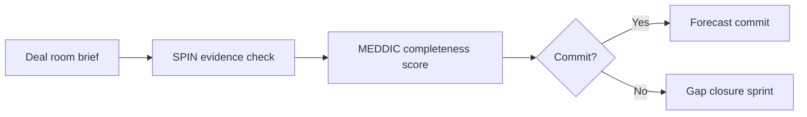

# Capstone: Deal Room Simulation: Core Concepts

## 😄 Meme Opener (cognitive ease)
**Meme concept:** "When the prospect says 'sounds good' and you mark it Commit without an Economic Buyer call."  
**Why this hurts in real life:** optimistic signals are not decision evidence.

## Quick Recap
- This module teaches the minimum evidence required to move a deal safely.
- Use the checklist below before advancing stage.
- Treat uncertainty as a work item, not a hope statement.

## Concept Clarity
Imagine a deal like crossing a river with stepping stones.  
SPIN helps you find where the stones are, MEDDIC checks whether each stone can hold your weight.  
If one is missing, you do not jump and pray, you place the stone first.

## Mermaid Visual

## Harvard-Style Case
### Case: Enterprise deal room simulation with SPIN + MEDDIC gate
**Context:** Team must decide go/no-go on a late-stage enterprise opportunity.

**Decision point:** Commit forecast or hold until evidence gaps are closed?

**Options considered:**
- Commit based on optimism
- Run full evidence review and conditional commit
- Auto-discount to force close

**Action taken:** Applied structured deal-room review with assigned owners for each missing proof item.

**Outcome:** Higher close confidence and cleaner executive forecast narrative.

**What we'd do differently:** Time-box deal-room pre-reads to improve meeting quality.

**Discussion questions:**
1. What evidence is mandatory for commit?
2. Which owner/date commitments reduce the highest risk first?

**Sources:**
- https://www.mural.co/blog/meddic-sales-methodology
- https://blog.hubspot.com/sales/sales-strategy

## Primary References
- https://meddicc.com/
- https://blog.hubspot.com/sales/sales-strategy

**Source quality note:** prioritize primary company/institution sources over commentary when updating this module.

## Execution Checklist
1. Confirm the real business pain in buyer language.
2. Quantify implication (cost, delay, risk, or lost revenue).
3. Validate stakeholder roles and decision path.
4. Define next step with owner, date, and proof target.

## Concept Clarity + TLDR Video Placeholders
- **Concept Clarity video:** [Watch](/assets/courses/sales-spin-meddic/videos/08-capstone-deal-room-eli5.mp4)
- **Quick Recap video:** [Watch](/assets/courses/sales-spin-meddic/videos/08-capstone-deal-room-tldr.mp4)

## Downloadable Practical Artifacts
- [SPIN Discovery Template](/assets/courses/sales-spin-meddic/downloads/spin-discovery-template.md)
- [Stakeholder Map Template](/assets/courses/sales-spin-meddic/downloads/stakeholder-map-template.md)
- [MEDDIC Scorecard Template (CSV)](/assets/courses/sales-spin-meddic/downloads/meddic-scorecard-template.csv)
- [MEDDIC Filled Example (CSV)](/assets/courses/sales-spin-meddic/downloads/meddic-scorecard-filled-example.csv)
- [Forecast Confidence Rubric](/assets/courses/sales-spin-meddic/downloads/forecast-confidence-rubric.md)
- [Deal Room Checklist](/assets/courses/sales-spin-meddic/downloads/deal-room-checklist.md)

## Anti-Pattern to Avoid
Do not let strong rapport replace qualification evidence.
