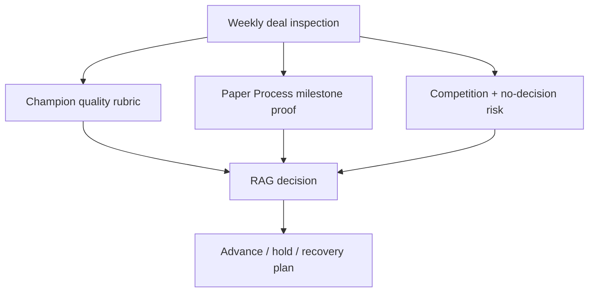

---

## 🏗️ Your Running Project

**What you're building:** You are closing a $250k enterprise deal using SPIN, MEDDIC, and Challenger selling — from discovery to signed contract.
**What this module adds:** Run a full MEDDPICC deal inspection and identify gaps.

> *Every decision here carries forward.*

# MEDDPICC Deal Inspection Mechanics

## 😄 Meme Opener (cognitive ease)
**Meme concept:** Pipeline review where every deal is green because everyone sounds confident.

## Quick Recap
- MEDDPICC works only when applied in a weekly inspection rhythm.
- Deals must earn progression with evidence, not narrative.
- RAG rules should be explicit and non-negotiable.

## Concept Clarity
A good inspection is like a pre-flight checklist.  
You do not skip a control because the pilot feels lucky.

## Mermaid Visual

## Harvard-Style Case
### Case: Forecast integrity reset in multi-region SaaS team
**Context:** Team repeatedly missed commit despite healthy pipeline volume.

**Decision point:** Keep rep-owned narrative updates, or install strict MEDDPICC RAG inspection board?

**Options considered:**
- Keep current meetings but add more dashboards
- Implement weekly inspection with red-gate freeze rules
- Reclassify all uncertain deals as upside only at quarter end

**Action taken:** Implemented MEDDPICC inspection worksheet, champion rubric, and red-gate freeze.

**Outcome:** Fewer surprise slips and clearer deal recovery actions.

**Discussion questions:**
1. Which two fields are most predictive of late-stage slips in your segment?
2. What should trigger an automatic red gate?

## Primary References
- https://meddicc.com/
- https://www.gong.io/blog/sales-forecasting/

**Source quality note:** prioritize benchmarked forecast-performance data over anecdotal manager preference.

## Execution Checklist
1. Review each open deal against MEDDPICC evidence fields.
2. Score champion quality (access, influence, intent, political safety).
3. Validate paper-process milestone certainty with owner/date proof.
4. Rate competition including no-decision and incumbent renewal gravity.
5. Apply RAG rule, then assign concrete recovery actions for yellow/red deals.

## Concept Clarity + TLDR Video Placeholders
- **Concept Clarity video:** [Watch](/assets/courses/sales-spin-meddic/videos/10-meddpicc-deal-inspection-eli5.mp4)
- **Quick Recap video:** [Watch](/assets/courses/sales-spin-meddic/videos/10-meddpicc-deal-inspection-tldr.mp4)

## Downloadable Practical Artifacts
- [MEDDPICC Scorecard Template (CSV)](/assets/courses/sales-spin-meddic/downloads/meddpicc-scorecard-template.csv)
- [Deal Inspection RAG Rules](/assets/courses/sales-spin-meddic/downloads/deal-inspection-rag-rules.md)
- [Paper Process Map Template](/assets/courses/sales-spin-meddic/downloads/paper-process-map-template.md)

## Anti-Pattern to Avoid
Do not allow "manager confidence" to override missing evidence on red-gate fields.
