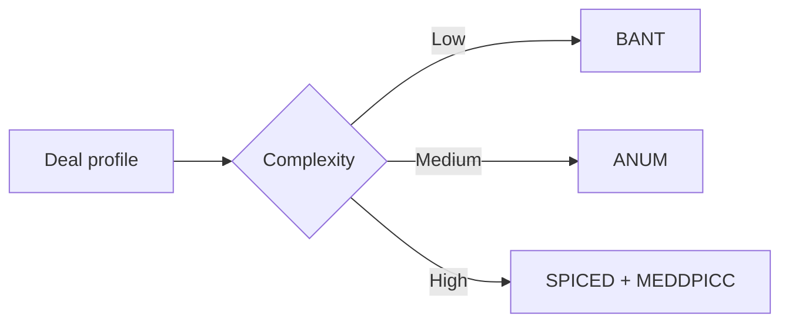

---

## 🏗️ Your Running Project

**What you're building:** You are closing a $250k enterprise deal using SPIN, MEDDIC, and Challenger selling — from discovery to signed contract.
**What this module adds:** Compare qualification models and select the right one for your motion.

> *Every decision here carries forward.*

## 😄 Meme Opener

> *"BANT: the qualification framework that qualifies deals that aren't qualified."*

# Qualification Alternatives: BANT, ANUM, SPICED

## Quick Recap
- No single model fits every motion.
- Lighter models are useful when sales cycles are short and buyer committees are small.
- For enterprise complexity, combine with MEDDPICC controls.

## Mermaid Visual

## Execution Checklist
1. Classify deal complexity (ACV, stakeholders, compliance).
2. Pick baseline qualification model.
3. Define escalation trigger into MEDDPICC.
4. Capture owner/date next actions.

## Downloadable Practical Artifacts
- [Framework Selector Matrix](/assets/courses/sales-spin-meddic/downloads/framework-selector-matrix.csv)

## Anti-Pattern to Avoid
Running enterprise deals with lightweight qualification only.

---

## 🎓 Harvard-Style Case Study — Qualification model selection and adoption

**Context:** A team used BANT for 2 years. It qualified deals with budget but no authority. 35% of forecast deals had no Economic Buyer identified.

**The tension:** Ship the campaign vs build the data/process control that prevents the failure.

**Decision options:**
1. Replace BANT with MEDDIC as the primary qualification model
2. add MEDDIC as a secondary check after BANT
3. run a retrospective on lost deals to find which BANT-qualified deals failed and why

**Discussion questions:**
1. What observable signal would have caught this before it damaged the business?
2. Which option gives the best risk/effort tradeoff for a lean team?
3. Write a one-sentence policy rule that would prevent this failure mode.

---

## 🤖 Solo AI Discussion Prompt

**Red Team:** "You are reviewing this decision. Find the top 2 ways it will fail and how to close those gaps."

**Socratic Coach:** "Ask me one question at a time. Force me to justify each choice with evidence. After 6 questions, score my thinking."
