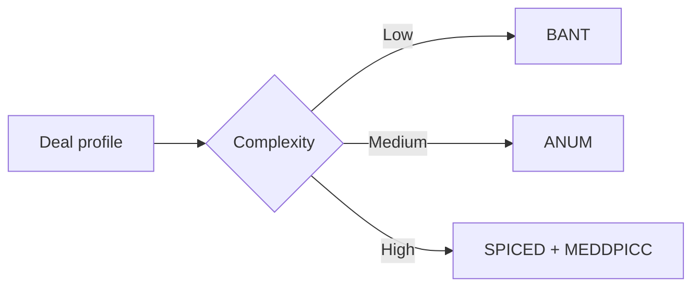

# Qualification Alternatives: BANT, ANUM, SPICED

## Quick Recap
- No single model fits every motion.
- Lighter models are useful when sales cycles are short and buyer committees are small.
- For enterprise complexity, combine with MEDDPICC controls.

## Mermaid Visual

## Execution Checklist
1. Classify deal complexity (ACV, stakeholders, compliance).
2. Pick baseline qualification model.
3. Define escalation trigger into MEDDPICC.
4. Capture owner/date next actions.

## Downloadable Practical Artifacts
- [Framework Selector Matrix](/assets/courses/sales-spin-meddic/downloads/framework-selector-matrix.csv)

## Anti-Pattern to Avoid
Running enterprise deals with lightweight qualification only.
