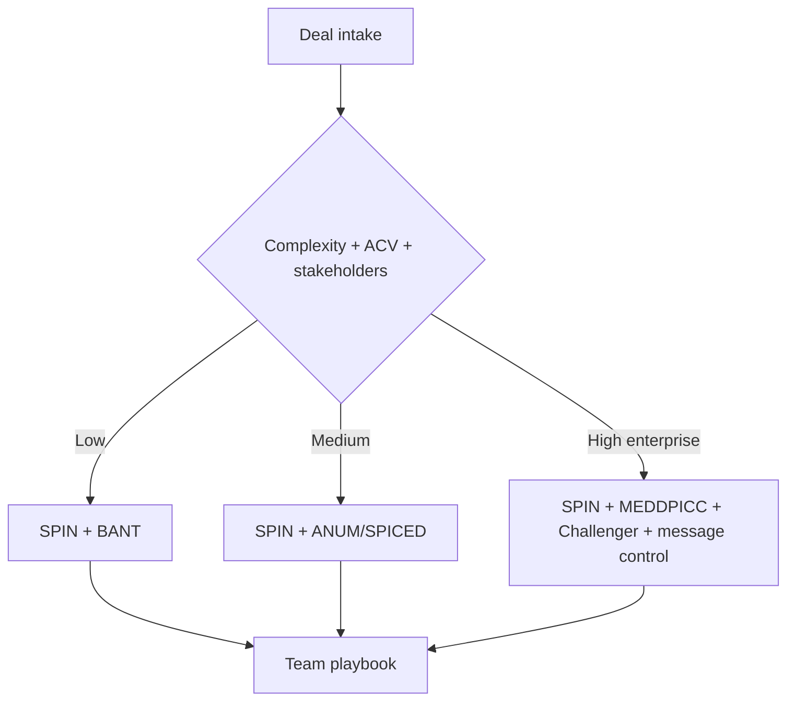

---

## 🏗️ Your Running Project

**What you're building:** You are closing a $250k enterprise deal using SPIN, MEDDIC, and Challenger selling — from discovery to signed contract.
**What this module adds:** Build the complete multi-methodology close plan for your deal.

> *Every decision here carries forward.*

## 😄 Meme Opener

> *"Best methodology: whichever one you actually use consistently."*

# Methodology Comparison + Orchestration

## Quick Recap
- Pick frameworks based on objective deal signals, not rep preference.
- Use one primary and one fallback method per segment.
- Keep governance simple with explicit stage-gate evidence.

## Mermaid Visual

## Execution Checklist
1. Define deal-shape tiers by ACV and committee complexity.
2. Assign primary + fallback framework per tier.
3. Attach required evidence gates per stage.
4. Review performance monthly and update routing rules.

## Downloadable Practical Artifacts
- [Framework Selector Matrix](/assets/courses/sales-spin-meddic/downloads/framework-selector-matrix.csv)
- [Methodology Decision Tree](/assets/courses/sales-spin-meddic/downloads/methodology-decision-tree.md)

## Anti-Pattern to Avoid
Letting each rep choose framework ad hoc without segment-level policy.

---

## 🎓 Harvard-Style Case Study — Methodology selection, adoption, and long-term commitment

**Context:** A company adopted 4 methodologies over 5 years. Each time the old one 'didn't work.' The real problem was inconsistent adoption, not the methodology.

**The tension:** Ship the campaign vs build the data/process control that prevents the failure.

**Decision options:**
1. Select one methodology, commit for 3 years, and measure adoption
2. build a company-specific playbook that takes the best of each
3. add methodology compliance to manager QBRs and coaching cadence

**Discussion questions:**
1. What observable signal would have caught this before it damaged the business?
2. Which option gives the best risk/effort tradeoff for a lean team?
3. Write a one-sentence policy rule that would prevent this failure mode.

---

## 🤖 Solo AI Discussion Prompt

**Red Team:** "You are reviewing this decision. Find the top 2 ways it will fail and how to close those gaps."

**Socratic Coach:** "Ask me one question at a time. Force me to justify each choice with evidence. After 6 questions, score my thinking."
