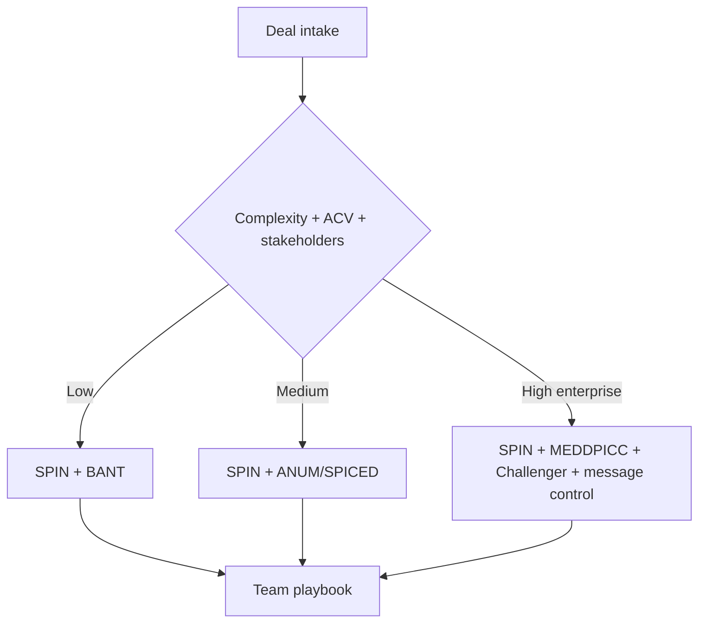

# Methodology Comparison + Orchestration

## Quick Recap
- Pick frameworks based on objective deal signals, not rep preference.
- Use one primary and one fallback method per segment.
- Keep governance simple with explicit stage-gate evidence.

## Mermaid Visual

## Execution Checklist
1. Define deal-shape tiers by ACV and committee complexity.
2. Assign primary + fallback framework per tier.
3. Attach required evidence gates per stage.
4. Review performance monthly and update routing rules.

## Downloadable Practical Artifacts
- [Framework Selector Matrix](/assets/courses/sales-spin-meddic/downloads/framework-selector-matrix.csv)
- [Methodology Decision Tree](/assets/courses/sales-spin-meddic/downloads/methodology-decision-tree.md)

## Anti-Pattern to Avoid
Letting each rep choose framework ad hoc without segment-level policy.
