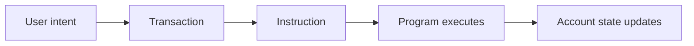

## 🎮 The Game

**Before you read anything, here's what you're going to build:**

> An NFT marketplace on Solana — where buyers and sellers trade digital assets with atomic escrow, verified pricing, and wallet-native authentication.

**Here's the junior version. Try it now:**

You don't know Solana yet. That's fine. Answer these from first principles:

```json
{
  "what_is_a_wallet": "",
  "what_happens_when_you_buy_an_nft": "",
  "where_does_the_nft_actually_live": "",
  "what_stops_someone_from_stealing_it": ""
}
```

Don't look anything up. Your answers here are your learning agenda for this course. Whatever you got wrong, this course will fix.

---

---

## 🏗️ Your Running Project

**What you're building:** An NFT marketplace on Solana — production-grade, end-to-end.
**What this module adds:** Understand the rules of the game — what an NFT marketplace does and how Solana makes it possible.
**What you'll have at the end:** A concrete deliverable that builds directly on the previous module.

> *This module is one piece of a game you've been playing since Module 0. Every decision you make here carries forward.*

# Solana First Principles — Mental Models and Vocabulary

## 😄 Meme Opener
**Meme concept:** "I thought program = app + database + wallet + vibes."  
**Why this hurts in real life:** blurred vocabulary causes architecture mistakes before code even compiles.


## Quick Recap
- Programs are executable logic.
- Accounts store data and lamports.
- Transactions bundle instructions and required accounts/signers.
- Environment progression (local/devnet/testnet/mainnet) is a risk ladder, not just a speed ladder.

## Concept Clarity
Think of Solana like a theatre:
- **Program** = script for actors to follow.
- **Accounts** = props and state on stage.
- **Transaction** = a scheduled scene with specific actors and props.
- **Signer** = someone authorized to approve the scene.

## Mermaid Visual


## Harvard-Style Case
**Context:** A beginner team mixed up program ownership and account mutability, then spent a week debugging failed writes.

**Decision point:** Continue patching ad-hoc or pause and create a shared first-principles model?

**Action taken:** They defined vocabulary, ownership, and signer expectations before touching logic again.

**Outcome:** Debug time dropped and code reviews became faster and clearer.

**Discussion questions:**
1. Which two Solana terms does your team currently use inconsistently?
2. What confusion appears most often in PR reviews?

## Primary References
- https://solana.com/docs/core/accounts
- https://solana.com/docs/core/transactions
- https://solana.com/docs/core/instructions

## Downloadable Practical Artifacts
- [First Principles Glossary](/assets/courses/solana-academy/downloads/00-solana-first-principles-glossary.md)
- [Mental Model Worksheet](/assets/courses/solana-academy/downloads/00-solana-first-principles-worksheet.md)

## Anti-Pattern to Avoid
Skipping shared vocabulary and hoping implementation will “self-document” architecture.
