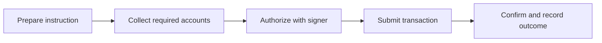

# Solana First Principles — Transaction Lifecycle and Signers

## 😄 Meme Opener
**Meme concept:** "We had one signer for everything. It was called yolo-admin."  
**Why this hurts in real life:** single-scope authority models are a common root cause in preventable incidents.

## Quick Recap
- A transaction is prepared, signed, submitted, and confirmed.
- Signers are explicit authorities, not convenience tokens.
- User actions and admin actions should not share the same authority lane.

## Concept Clarity
Treat signer permissions like building access cards:
- employee card (normal app actions)
- operator card (maintenance)
- emergency card (break-glass)

Different cards, different blast radius.

## Mermaid Visual

## Harvard-Style Case
**Context:** A startup used one broad signer role to move quickly through MVP delivery.

**Decision point:** Keep one signer role for speed or split authority into user/admin/recovery paths before public beta?

**Action taken:** Team introduced role-separated signing and documented rollback ownership.

**Outcome:** Slightly slower release, materially safer operations and clearer incident response.

**Discussion questions:**
1. Which signer actions in your current app are over-scoped?
2. What should require explicit second approval?

## Primary References
- https://solana.com/docs/core/transactions
- https://solana.com/docs/references/security

## Downloadable Practical Artifacts
- [Signer Policy Template](/assets/courses/solana-academy/downloads/00-solana-signer-policy-template.md)
- [Launch Authority Checklist](/assets/courses/solana-academy/downloads/00-solana-launch-authority-checklist.md)

## Anti-Pattern to Avoid
Treating signer policy as a late-stage compliance task instead of a design-time decision.
