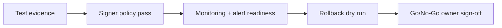

# Solana First Principles — Safe First Launch Checklist

## 😄 Meme Opener
**Meme concept:** "Every box was checked, just not in the same timeline."  
**Why this hurts in real life:** most launch failures happen because controls were unordered or unowned.

## Quick Recap
- Safe launch is a sequence, not a vibe.
- A gate should prove: test evidence, signer policy, monitoring, rollback readiness, and ownership.
- If one critical gate fails, release is blocked.

## Concept Clarity
A launch checklist is a risk compression tool.
It turns messy uncertainty into explicit yes/no decisions.

## Mermaid Visual

## Harvard-Style Case
**Context:** A beginner team had strong feature momentum but no explicit release owner.

**Decision point:** Keep informal release coordination or enforce a strict go/no-go sequence with named owners?

**Action taken:** They enforced ordered gates and a mandatory rollback rehearsal.

**Outcome:** A dependency mismatch was caught before release, preventing user-facing downtime.

**Discussion questions:**
1. Which gate in your current process is weakest and why?
2. Who can stop launch, and is that authority clear to everyone?

## Primary References
- https://solana.com/developers/courses
- https://solana.com/docs/references/security

## Downloadable Practical Artifacts
- [Beginner Launch Gate Template](/assets/courses/solana-academy/downloads/00-solana-beginner-launch-gate.md)
- [Go/No-Go Decision Log](/assets/courses/solana-academy/downloads/00-solana-go-no-go-log.csv)

## Anti-Pattern to Avoid
Promoting to higher environments based on confidence language instead of explicit evidence.
