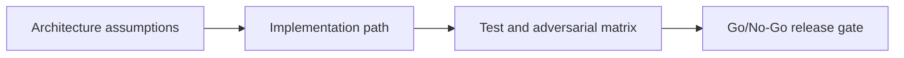

---

## 🏗️ Your Running Project

**What you're building:** An NFT marketplace on Solana — production-grade, end-to-end.
**What this module adds:** Add atomic escrow for safe trades — buyer funds locked until NFT transfer confirms.
**What you'll have at the end:** A concrete deliverable that builds directly on the previous module.

> *This module is one piece of a game you've been playing since Module 0. Every decision you make here carries forward.*

# Anchor Escrow Lab — Architecture and Case Design

## 😄 Meme Opener
**Meme concept:** "Works on my machine" meets Solana state invariants.
**Why this hurts in real life:** production failures usually come from untested assumptions, not syntax mistakes.

## Quick Recap
- Module focus: Build a production-safe escrow in Anchor using PDA seeds, account constraints, signer checks, and deterministic settlement paths.
- Escrow case study remains the continuity backbone across framework layers.
- You pass by showing evidence, not by saying "done".

## Concept Clarity
This mission is a three-step ladder: architecture first, implementation second, adversarial launch gate third.
If any rung is weak, the release is blocked.

## Mermaid Visual

## Harvard-Style Case
**Case pack entry:** [Case 1: Escrow Release Deadlock](/assets/courses/solana-academy/downloads/solana-case-pack-source-rigor.md)

**Case pack note:** synthetic teaching case derived from repo-owned Solana planning content; technical grounding comes from the linked Anchor account-constraint and testing docs.

**Context:** A marketplace escrow stalls because signer authority, PDA ownership, and timeout paths were specified too loosely.

**Decision point:** patch the release path quickly, add manual operations, or redesign the state machine before more trades enter escrow?

**Discussion questions:**
1. Which authority invariant must block launch?
2. Who owns rollback if funds are locked but settlement is incomplete?

## Primary References
- https://www.anchor-lang.com/docs
- https://www.anchor-lang.com/docs/references/account-constraints
- https://www.anchor-lang.com/docs/testing

## Downloadable Practical Artifacts
- [Artifact](/assets/courses/solana-academy/downloads/09-anchor-escrow-lab-implementation-runbook.md)
- [Artifact](/assets/courses/solana-academy/downloads/09-anchor-escrow-lab-adversarial-test-matrix.csv)
- [Artifact](/assets/courses/solana-academy/downloads/09-anchor-escrow-lab-release-gate-checklist.md)

## Anti-Pattern to Avoid
Treating devnet success as proof of production safety without adversarial evidence and release gate documentation.
