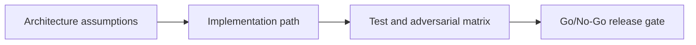

# Anchor Escrow Lab — Adversarial Testing and Launch Gate

## 😄 Meme Opener
**Meme concept:** "Works on my machine" meets Solana state invariants.
**Why this hurts in real life:** production failures usually come from untested assumptions, not syntax mistakes.

## Quick Recap
- Module focus: Build a production-safe escrow in Anchor using PDA seeds, account constraints, signer checks, and deterministic settlement paths.
- Escrow case study remains the continuity backbone across framework layers.
- You pass by showing evidence, not by saying "done".

## Concept Clarity
This mission is a three-step ladder: architecture first, implementation second, adversarial launch gate third.
If any rung is weak, the release is blocked.

## Mermaid Visual

## Harvard-Style Case
**Context:** Team velocity is high, but a single unchecked account/signature rule can create irreversible loss.

**Decision point:** prioritize feature speed or enforce strict gate policy per mission step?

**Action taken:** team enforces mission-based gating with explicit invariants and rollback notes.

**Outcome:** fewer regressions and cleaner incident response posture.

**Discussion questions:**
1. Which invariant would fail first under malicious input?
2. Which check must block deployment even when functional tests pass?

## Primary References
- https://www.anchor-lang.com/docs
- https://www.anchor-lang.com/docs/references/account-constraints
- https://www.anchor-lang.com/docs/testing

## Downloadable Practical Artifacts
- [Artifact](/assets/courses/solana-academy/downloads/09-anchor-escrow-lab-implementation-runbook.md)
- [Artifact](/assets/courses/solana-academy/downloads/09-anchor-escrow-lab-adversarial-test-matrix.csv)
- [Artifact](/assets/courses/solana-academy/downloads/09-anchor-escrow-lab-release-gate-checklist.md)

## Anti-Pattern to Avoid
Treating devnet success as proof of production safety without adversarial evidence and release gate documentation.

---

## 🎓 Harvard-Style Case Study — Escrow Release Deadlock

**Context:** A marketplace escrow flow stalled in production when signer authority and timeout logic were under-specified. The program allowed the initializer to lock funds indefinitely, with no fallback release path.

**The tension:** The team could patch fast (manual ops workaround, ship a v2) or stop and redesign the state machine to be explicit about authority and timeout ownership.

**Decision options:**
1. Hotfix: add emergency authority override and deploy immediately
2. Temporary ops: admin-triggered release via upgrade, announce outage
3. Redesign: pause all new escrows, architect explicit `release_authority` + `expiry_ts` with clear fallback

**What happened:** The team chose option 2 under pressure, creating a trust incident. Option 3 was the right call.

**Class focus:** Authority modeling, state transitions, rollback ownership.

**Discussion questions:**
1. At what point should a development team escalate a "could cause fund loss" finding versus ship a hotfix?
2. What invariants would you add to the anchor program to make this impossible in v2?
3. Write a one-sentence go/no-go policy for signer-authority validation before any escrow module ships.

---

## 🤖 Solo AI Discussion Prompts

Use one of these with Claude or ChatGPT — paste the case context above first.

**Socratic Coach:** "Act as a strict but supportive Solana architecture coach. Ask me one question at a time about this case, force me to justify each decision with risk controls, and do not let me skip tradeoffs. After 10 questions, grade me on clarity, correctness, and operational realism."

**Red Team:** "You are red-teaming my case decision. Assume my plan will fail. Find the top 5 failure modes, explain blast radius, and propose stronger guardrails. Then ask me to revise the plan and compare v1 vs v2."

**Operator Board:** "Simulate a go/no-go operations board with three personas: engineering lead, security lead, and product lead. Debate the launch decision from this case and end with a majority decision plus dissent note."
