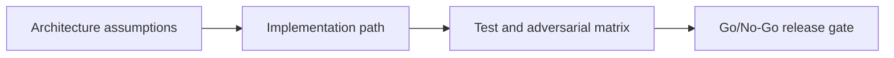

---

## 🏗️ Your Running Project

**What you're building:** An NFT marketplace on Solana — production-grade, end-to-end.
**What this module adds:** Add swap routing so buyers can pay in any token — Jupiter handles the conversion.
**What you'll have at the end:** A concrete deliverable that builds directly on the previous module.

> *This module is one piece of a game you've been playing since Module 0. Every decision you make here carries forward.*

# DeFi Layer 1 — Jupiter Integration — Architecture and Case Design

## 😄 Meme Opener
**Meme concept:** "Works on my machine" meets Solana state invariants.
**Why this hurts in real life:** production failures usually come from untested assumptions, not syntax mistakes.

## Quick Recap
- Module focus: Layer Jupiter quote/build/order APIs over escrow settlement with slippage and route-policy controls.
- Escrow case study remains the continuity backbone across framework layers.
- You pass by showing evidence, not by saying "done".

## Concept Clarity
This mission is a three-step ladder: architecture first, implementation second, adversarial launch gate third.
If any rung is weak, the release is blocked.

## Mermaid Visual

## Harvard-Style Case
**Case pack entry:** [Case 5: DeFi Integration Slippage and User Trust](/assets/courses/solana-academy/downloads/solana-case-pack-source-rigor.md)

**Case pack note:** synthetic teaching case derived from repo-owned Solana planning content; technical grounding comes from the linked Jupiter developer docs.

**Context:** A marketplace adds token swap routing, but volatile pools produce payment outcomes outside user expectations.

**Decision point:** maximize conversion throughput or enforce stricter route, preview, and slippage defaults?

**Discussion questions:**
1. What slippage ceiling should block execution by default?
2. Which route-policy constraint protects trust even when it lowers conversion?

## Primary References
- https://developers.jup.ag/docs/get-started
- https://developers.jup.ag/docs/guides

## Downloadable Practical Artifacts
- [Artifact](/assets/courses/solana-academy/downloads/12-jupiter-defi-integration-implementation-runbook.md)
- [Artifact](/assets/courses/solana-academy/downloads/12-jupiter-defi-integration-adversarial-test-matrix.csv)
- [Artifact](/assets/courses/solana-academy/downloads/12-jupiter-defi-integration-release-gate-checklist.md)

## Anti-Pattern to Avoid
Treating devnet success as proof of production safety without adversarial evidence and release gate documentation.
