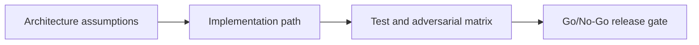

# DeFi Layer 1 — Jupiter Integration — Adversarial Testing and Launch Gate

## 😄 Meme Opener
**Meme concept:** "Works on my machine" meets Solana state invariants.
**Why this hurts in real life:** production failures usually come from untested assumptions, not syntax mistakes.

## Quick Recap
- Module focus: Layer Jupiter quote/build/order APIs over escrow settlement with slippage and route-policy controls.
- Escrow case study remains the continuity backbone across framework layers.
- You pass by showing evidence, not by saying "done".

## Concept Clarity
This mission is a three-step ladder: architecture first, implementation second, adversarial launch gate third.
If any rung is weak, the release is blocked.

## Mermaid Visual

## Harvard-Style Case
**Context:** Team velocity is high, but a single unchecked account/signature rule can create irreversible loss.

**Decision point:** prioritize feature speed or enforce strict gate policy per mission step?

**Action taken:** team enforces mission-based gating with explicit invariants and rollback notes.

**Outcome:** fewer regressions and cleaner incident response posture.

**Discussion questions:**
1. Which invariant would fail first under malicious input?
2. Which check must block deployment even when functional tests pass?

## Primary References
- https://developers.jup.ag/docs/get-started
- https://developers.jup.ag/docs/guides

## Downloadable Practical Artifacts
- [Artifact](/assets/courses/solana-academy/downloads/12-jupiter-defi-integration-implementation-runbook.md)
- [Artifact](/assets/courses/solana-academy/downloads/12-jupiter-defi-integration-adversarial-test-matrix.csv)
- [Artifact](/assets/courses/solana-academy/downloads/12-jupiter-defi-integration-release-gate-checklist.md)

## Anti-Pattern to Avoid
Treating devnet success as proof of production safety without adversarial evidence and release gate documentation.

---

## 🎓 Harvard-Style Case Study — DeFi Integration Slippage and User Trust Erosion

**Context:** A Solana dApp integrated Jupiter for swap routing. During a volatile trading window, route execution produced outcomes significantly outside user expectations: slippage was 4x the displayed estimate. Several users reported losses they attributed to the dApp, not the market.

**The tension:** Maximise swap throughput and fee capture vs add explicit, conservative user protection constraints.

**Decision options:**
1. Add stricter slippage controls: enforce max_slippage_bps at the transaction level and reject routes exceeding it
2. Improve previews: show a prominent worst-case output and require user acknowledgement before execution
3. Route restrictions: disable routes with low liquidity depth or high price impact during volatile periods

**What happened:** Teams that shipped option 2 alone saw continued complaints. Options 1 + 3 combined with clear UX messaging rebuilt trust faster.

**Class focus:** Risk controls, product ethics, transparent defaults.

**Discussion questions:**
1. What default slippage tolerance is appropriate for a beginner-facing swap interface? Why?
2. How do you balance user protection with execution speed in a high-volatility scenario?
3. Draft the two-sentence disclaimer a DeFi product should show before any swap involving a low-liquidity pool.

---

## 🤖 Solo AI Discussion Prompts

Use one of these with Claude or ChatGPT — paste the case context above first.

**Operator Board:** "Simulate a go/no-go operations board with three personas: engineering lead, security lead, and product lead. Debate the launch decision from this case and end with a majority decision plus dissent note."

**Mentor Mode (Beginner):** "I am a beginner. Explain this case in simple language first, then walk me through a safe decision framework. Give me one tiny action item per step and check my understanding before moving on."

**Socratic Coach:** "Act as a strict but supportive Solana architecture coach. Ask me one question at a time about this case, force me to justify each decision with risk controls, and do not let me skip tradeoffs. After 10 questions, grade me on clarity, correctness, and operational realism."
