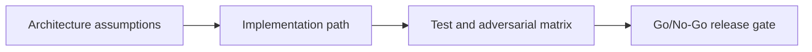

# Oracle Layer 1 — Chainlink Data Feeds — Adversarial Testing and Launch Gate

## 😄 Meme Opener
**Meme concept:** "Works on my machine" meets Solana state invariants.
**Why this hurts in real life:** production failures usually come from untested assumptions, not syntax mistakes.

## Quick Recap
- Module focus: Use Chainlink Solana Data Feeds as guardrails for price checks, settlement bounds, and circuit-breakers.
- Escrow case study remains the continuity backbone across framework layers.
- You pass by showing evidence, not by saying "done".

## Concept Clarity
This mission is a three-step ladder: architecture first, implementation second, adversarial launch gate third.
If any rung is weak, the release is blocked.

## Mermaid Visual

## Harvard-Style Case
**Context:** Team velocity is high, but a single unchecked account/signature rule can create irreversible loss.

**Decision point:** prioritize feature speed or enforce strict gate policy per mission step?

**Action taken:** team enforces mission-based gating with explicit invariants and rollback notes.

**Outcome:** fewer regressions and cleaner incident response posture.

**Discussion questions:**
1. Which invariant would fail first under malicious input?
2. Which check must block deployment even when functional tests pass?

## Primary References
- https://docs.chain.link/data-feeds/solana
- https://docs.chain.link/data-feeds/price-feeds

## Downloadable Practical Artifacts
- [Artifact](/assets/courses/solana-academy/downloads/14-chainlink-oracle-integration-implementation-runbook.md)
- [Artifact](/assets/courses/solana-academy/downloads/14-chainlink-oracle-integration-adversarial-test-matrix.csv)
- [Artifact](/assets/courses/solana-academy/downloads/14-chainlink-oracle-integration-release-gate-checklist.md)

## Anti-Pattern to Avoid
Treating devnet success as proof of production safety without adversarial evidence and release gate documentation.

---

## 🎓 Harvard-Style Case Study — Oracle Drift and Unsafe Liquidation

**Context:** During a volatile market period, oracle feed lag of ~3 seconds caused a DeFi protocol on Solana to execute liquidations at stale prices. Several users were liquidated at positions that would have been safe under real-time prices.

**The tension:** Keep the protocol live and fully functional vs activate a conservative safety mode that pauses liquidations until oracle freshness is confirmed.

**Decision options:**
1. Stay live: monitor closely, accept short-term risk while fixing the oracle feed refresh rate
2. Pause liquidations: halt the most risky operations until staleness window is resolved
3. Add a staleness guard: deploy a price freshness check (reject prices older than N slots) before any liquidation can proceed

**What happened:** Teams that stayed live with option 1 faced user compensation claims. Teams that added option 3 guards recovered user trust fastest.

**Class focus:** Failure budgets, fallback data sources, incident communication.

**Discussion questions:**
1. What is an acceptable oracle staleness threshold for a liquidation operation? How would you derive this number?
2. How would you design a circuit breaker for price-sensitive operations on Solana?
3. Draft a one-paragraph incident response communication for users affected by a stale-price liquidation.

---

## 🤖 Solo AI Discussion Prompts

Use one of these with Claude or ChatGPT — paste the case context above first.

**Red Team:** "You are red-teaming my case decision. Assume my plan will fail. Find the top 5 failure modes, explain blast radius, and propose stronger guardrails. Then ask me to revise the plan and compare v1 vs v2."

**Interview Panel:** "Run this like a production design interview for a Solana role. Ask architecture, signer-policy, test-gate, and incident-response questions based on this case. Score each answer out of 10 and identify weak spots."

**Mentor Mode (Beginner):** "I am a beginner. Explain this case in simple language first, then walk me through a safe decision framework. Give me one tiny action item per step and check my understanding before moving on."
