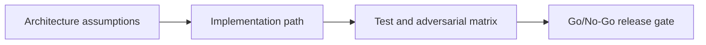

# Oracle Layer 2 — Pyth Integration — Architecture and Case Design

## 😄 Meme Opener
**Meme concept:** "Works on my machine" meets Solana state invariants.
**Why this hurts in real life:** production failures usually come from untested assumptions, not syntax mistakes.

## Quick Recap
- Module focus: Consume Pyth updates with confidence interval checks and freshness limits for safer execution policy.
- Escrow case study remains the continuity backbone across framework layers.
- You pass by showing evidence, not by saying "done".

## Concept Clarity
This mission is a three-step ladder: architecture first, implementation second, adversarial launch gate third.
If any rung is weak, the release is blocked.

## Mermaid Visual

## Harvard-Style Case
**Context:** Team velocity is high, but a single unchecked account/signature rule can create irreversible loss.

**Decision point:** prioritize feature speed or enforce strict gate policy per mission step?

**Action taken:** team enforces mission-based gating with explicit invariants and rollback notes.

**Outcome:** fewer regressions and cleaner incident response posture.

**Discussion questions:**
1. Which invariant would fail first under malicious input?
2. Which check must block deployment even when functional tests pass?

## Primary References
- https://docs.pyth.network/price-feeds/core/price-feeds
- https://docs.pyth.network/price-feeds/core/use-real-time-data/pull-integration/solana

## Downloadable Practical Artifacts
- [Artifact](/assets/courses/solana-academy/downloads/15-pyth-oracle-integration-implementation-runbook.md)
- [Artifact](/assets/courses/solana-academy/downloads/15-pyth-oracle-integration-adversarial-test-matrix.csv)
- [Artifact](/assets/courses/solana-academy/downloads/15-pyth-oracle-integration-release-gate-checklist.md)

## Anti-Pattern to Avoid
Treating devnet success as proof of production safety without adversarial evidence and release gate documentation.
