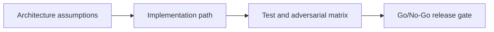

---

## 🏗️ Your Running Project

**What you're building:** An NFT marketplace on Solana — production-grade, end-to-end.
**What this module adds:** Add real-time low-latency pricing with Pyth for time-sensitive auctions.
**What you'll have at the end:** A concrete deliverable that builds directly on the previous module.

> *This module is one piece of a game you've been playing since Module 0. Every decision you make here carries forward.*

# Oracle Layer 2 — Pyth Integration — Architecture and Case Design

## 😄 Meme Opener
**Meme concept:** "Works on my machine" meets Solana state invariants.
**Why this hurts in real life:** production failures usually come from untested assumptions, not syntax mistakes.

## Quick Recap
- Module focus: Consume Pyth updates with confidence interval checks and freshness limits for safer execution policy.
- Escrow case study remains the continuity backbone across framework layers.
- You pass by showing evidence, not by saying "done".

## Concept Clarity
This mission is a three-step ladder: architecture first, implementation second, adversarial launch gate third.
If any rung is weak, the release is blocked.

## Mermaid Visual

```mermaid
flowchart LR
  A[Architecture assumptions] --> B[Implementation path]
  B --> C[Test and adversarial matrix]
  C --> D[Go/No-Go release gate]
```

## Harvard-Style Case
**Case pack entry:** [Case 2: Oracle Drift and Unsafe Execution](/assets/courses/solana-academy/downloads/solana-case-pack-source-rigor.md)

**Case pack note:** synthetic teaching case derived from repo-owned Solana planning content; technical grounding comes from the linked Pyth price-feed and pull-integration docs.

**Context:** A price feed remains technically available, but volatility makes freshness and confidence bounds unsafe for auction execution.

**Decision point:** keep execution open, halt risky actions, widen safety bounds, or switch to a fallback data policy?

**Discussion questions:**
1. Which freshness or confidence threshold should trigger safety mode?
2. What incident message should users see when execution is blocked?

## Primary References
- https://docs.pyth.network/price-feeds/core/price-feeds
- https://docs.pyth.network/price-feeds/core/use-real-time-data/pull-integration/solana

## Downloadable Practical Artifacts
- [Artifact](/assets/courses/solana-academy/downloads/15-pyth-oracle-integration-implementation-runbook.md)
- [Artifact](/assets/courses/solana-academy/downloads/15-pyth-oracle-integration-adversarial-test-matrix.csv)
- [Artifact](/assets/courses/solana-academy/downloads/15-pyth-oracle-integration-release-gate-checklist.md)

## Anti-Pattern to Avoid
Treating devnet success as proof of production safety without adversarial evidence and release gate documentation.
