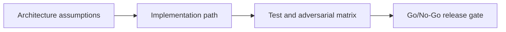

# VRM Lab — Commit-Reveal and Dutch Auction — Implementation Lab

## 😄 Meme Opener
**Meme concept:** "Works on my machine" meets Solana state invariants.
**Why this hurts in real life:** production failures usually come from untested assumptions, not syntax mistakes.

## Quick Recap
- Module focus: Implement verifiable randomness with Switchboard commit-reveal and a Dutch-auction path using Chainlink guardrails.
- Escrow case study remains the continuity backbone across framework layers.
- You pass by showing evidence, not by saying "done".

## Concept Clarity
This mission is a three-step ladder: architecture first, implementation second, adversarial launch gate third.
If any rung is weak, the release is blocked.

## Mermaid Visual

## Harvard-Style Case
**Context:** Team velocity is high, but a single unchecked account/signature rule can create irreversible loss.

**Decision point:** prioritize feature speed or enforce strict gate policy per mission step?

**Action taken:** team enforces mission-based gating with explicit invariants and rollback notes.

**Outcome:** fewer regressions and cleaner incident response posture.

**Discussion questions:**
1. Which invariant would fail first under malicious input?
2. Which check must block deployment even when functional tests pass?

## Primary References
- https://docs.switchboard.xyz/docs-by-chain/solana-svm/randomness/randomness-tutorial
- https://docs.chain.link/data-feeds/solana

## Downloadable Practical Artifacts
- [Artifact](/assets/courses/solana-academy/downloads/16-verifiable-randomness-auctions-implementation-runbook.md)
- [Artifact](/assets/courses/solana-academy/downloads/16-verifiable-randomness-auctions-adversarial-test-matrix.csv)
- [Artifact](/assets/courses/solana-academy/downloads/16-verifiable-randomness-auctions-release-gate-checklist.md)

## Anti-Pattern to Avoid
Treating devnet success as proof of production safety without adversarial evidence and release gate documentation.
