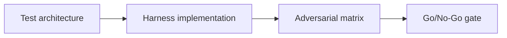

# Testing Lab — Surfpool Workflows — Core Concepts

## 😄 Meme Opener
**Meme concept:** "All tests passed" (except the ones we forgot to write).
**Why this hurts in real life:** speed without coverage creates expensive incidents.

## Quick Recap
- Build fast local-test loops with Surfpool as a drop-in validator replacement, including runbooks, cheatcodes, and deterministic test gates.
- This module extends the escrow continuity case through testing infrastructure.
- Mission success requires reproducible evidence, not claims.

## Concept Clarity
We build in three passes: architecture, harness implementation, and adversarial release gating.
Missing any pass means no-go for deployment.

## Mermaid Visual

## Harvard-Style Case
**Context:** The team ships quickly but sees post-merge regressions from weak local test loops.

**Decision point:** keep loose tests for velocity, or enforce strict deterministic harness policy?

**Action taken:** standardized mission-based harnesses with explicit negative tests and release gates.

**Outcome:** faster triage, fewer regressions, more predictable releases.

**Discussion questions:**
1. Which tests are required to block unsafe merges?
2. What evidence should be attached to every release PR?

## Primary References
- https://docs.surfpool.run/
- https://docs.surfpool.run/toolchain/getting-started
- https://docs.surfpool.run/toolchain/cli
- https://solana.com/docs/intro/installation/surfpool-cli-basics

## Downloadable Practical Artifacts
- [Artifact](/assets/courses/solana-academy/downloads/17-surfpool-testing-lab-harness-template.md)
- [Artifact](/assets/courses/solana-academy/downloads/17-surfpool-testing-lab-test-matrix.csv)
- [Artifact](/assets/courses/solana-academy/downloads/17-surfpool-testing-lab-release-gate.md)

## Anti-Pattern to Avoid
Treating one-off green runs as proof of reliability without repeatability and adversarial evidence.
