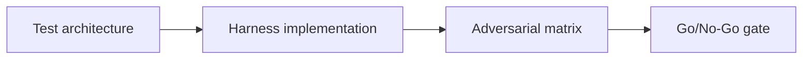

# Testing Lab — LiteSVM In-Process Testing — Adversarial Testing and Launch Gate

## 😄 Meme Opener
**Meme concept:** "All tests passed" (except the ones we forgot to write).
**Why this hurts in real life:** speed without coverage creates expensive incidents.

## Quick Recap
- Use LiteSVM for in-process Solana testing, compare speed/coverage tradeoffs, and enforce adversarial test suites for escrow continuity.
- This module extends the escrow continuity case through testing infrastructure.
- Mission success requires reproducible evidence, not claims.

## Concept Clarity
We build in three passes: architecture, harness implementation, and adversarial release gating.
Missing any pass means no-go for deployment.

## Mermaid Visual

## Harvard-Style Case
**Context:** The team ships quickly but sees post-merge regressions from weak local test loops.

**Decision point:** keep loose tests for velocity, or enforce strict deterministic harness policy?

**Action taken:** standardized mission-based harnesses with explicit negative tests and release gates.

**Outcome:** faster triage, fewer regressions, more predictable releases.

**Discussion questions:**
1. Which tests are required to block unsafe merges?
2. What evidence should be attached to every release PR?

## Primary References
- https://litesvm.com/docs/getting-started
- https://docs.rs/litesvm/latest/litesvm/
- https://www.anchor-lang.com/docs/testing/litesvm
- https://github.com/LiteSVM/litesvm

## Downloadable Practical Artifacts
- [Artifact](/assets/courses/solana-academy/downloads/18-litesvm-testing-lab-harness-template.md)
- [Artifact](/assets/courses/solana-academy/downloads/18-litesvm-testing-lab-test-matrix.csv)
- [Artifact](/assets/courses/solana-academy/downloads/18-litesvm-testing-lab-release-gate.md)

## 🤖 Solo AI Discussion Prompts

Use one of these with Claude or ChatGPT after you draft your LiteSVM test harness. Ask for questions, hints, and scoring before any suggested rewrite.

**In-Process Test Reviewer:** "Act as a LiteSVM reviewer. Ask me how my harness proves account setup, instruction ordering, signer errors, and edge cases without relying on network behavior. Give hints first; do not write the test code for me."

**Regression Gate Coach:** "Roleplay a regression gate coach. Ask which LiteSVM tests would catch a real production bug and which might give false confidence. Make me improve the matrix before you score it."

## Anti-Pattern to Avoid
Treating one-off green runs as proof of reliability without repeatability and adversarial evidence.
