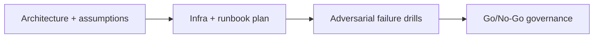

---

## 🏗️ Your Running Project

**What you're building:** An NFT marketplace on Solana — production-grade, end-to-end.
**What this module adds:** Run the infrastructure that your marketplace depends on for liveness.
**What you'll have at the end:** A concrete deliverable that builds directly on the previous module.

> *This module is one piece of a game you've been playing since Module 0. Every decision you make here carries forward.*

# Advanced Validators — Operations and Economics — Core Concepts

## 😄 Meme Opener
**Meme concept:** "We can run a validator" before counting hardware, bandwidth, and on-call reality.
**Why this hurts in real life:** validator ops fail from reliability and process gaps, not enthusiasm.

## Quick Recap
- Model hardware, bandwidth, reliability, key management, and cost realities of running a validator if sufficient resources are available.
- This module is intentionally advanced and operations-heavy.
- Mission pass requires evidence-backed decisions, not hand-wavy plans.

## Concept Clarity
We use a three-stage method: architecture design, implementation runbook, and adversarial go-live gating.
No stage can be skipped if the goal is a resilient validator operation.

## Mermaid Visual

## Harvard-Style Case
**Case pack entry:** [Case 4: Validator Ops Incident and Slow Recovery](/assets/courses/solana-academy/downloads/solana-case-pack-source-rigor.md)

**Case pack note:** synthetic teaching case derived from repo-owned Solana planning content; technical grounding comes from the linked Anza validator operations docs.

**Context:** Node instability, noisy alerts, and unclear failover ownership stretch the recovery window.

**Decision point:** stay online with degraded signals, fail over early and investigate, or reduce services until the runbook is proven?

**Discussion questions:**
1. Which metric should be your hard blocker first: latency, uptime, cost, or alert quality?
2. What single incident would force immediate failover?

## Primary References
- https://docs.anza.xyz/operations/requirements
- https://docs.anza.xyz/operations/setup-a-validator
- https://docs.anza.xyz/operations/guides/validator-start

## Downloadable Practical Artifacts
- [Artifact](/assets/courses/solana-academy/downloads/20-running-a-validator-ops-and-economics-hardware-and-network-checklist.md)
- [Artifact](/assets/courses/solana-academy/downloads/20-running-a-validator-ops-and-economics-cost-model-template.csv)
- [Artifact](/assets/courses/solana-academy/downloads/20-running-a-validator-ops-and-economics-incident-runbook.md)

## Anti-Pattern to Avoid
Running consensus infra with no tested incident plan, no cost envelope, and no validated recovery path.
