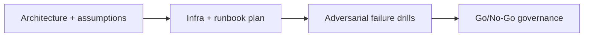

# Advanced Validators — Operations and Economics — Adversarial Ops and Go-Live Gate

## 😄 Meme Opener
**Meme concept:** "We can run a validator" before counting hardware, bandwidth, and on-call reality.
**Why this hurts in real life:** validator ops fail from reliability and process gaps, not enthusiasm.

## Quick Recap
- Model hardware, bandwidth, reliability, key management, and cost realities of running a validator if sufficient resources are available.
- This module is intentionally advanced and operations-heavy.
- Mission pass requires evidence-backed decisions, not hand-wavy plans.

## Concept Clarity
We use a three-stage method: architecture design, implementation runbook, and adversarial go-live gating.
No stage can be skipped if the goal is a resilient validator operation.

## Mermaid Visual

## Harvard-Style Case
**Context:** Team wants to run a validator but has limited staff and budget clarity.

**Decision point:** launch early with partial prep, or delay until reliability/economic thresholds are met?

**Action taken:** establish measurable requirements and hard release blockers.

**Outcome:** slower launch, significantly lower operational risk.

**Discussion questions:**
1. Which metric (latency, uptime, or cost) should be your hard blocker first?
2. What single incident would force immediate rollback?

## Primary References
- https://docs.anza.xyz/operations/requirements
- https://docs.anza.xyz/operations/setup-a-validator
- https://docs.anza.xyz/operations/guides/validator-start

## Downloadable Practical Artifacts
- [Artifact](/assets/courses/solana-academy/downloads/20-running-a-validator-ops-and-economics-hardware-and-network-checklist.md)
- [Artifact](/assets/courses/solana-academy/downloads/20-running-a-validator-ops-and-economics-cost-model-template.csv)
- [Artifact](/assets/courses/solana-academy/downloads/20-running-a-validator-ops-and-economics-incident-runbook.md)

## Anti-Pattern to Avoid
Running consensus infra with no tested incident plan, no cost envelope, and no validated recovery path.

---

## 🎓 Harvard-Style Case Study — Validator Ops Incident and Slow Recovery

**Context:** A Solana validator node began showing erratic slot confirmation rates. Alert fatigue meant the on-call team dismissed early warning signals. By the time root cause was isolated (a disk IO bottleneck causing leader slot misses), the validator had missed 4 hours of rewards and been delinquency-flagged by stake pools.

**The tension:** Keep the validator online in a degraded state while debugging vs fail over to a standby node early, accepting the 1-2 epoch penalty.

**Decision options:**
1. Debug in-place: keep the primary node running, monitor and tune while live
2. Early failover: switch to standby node immediately, investigate primary offline
3. Reduce services: take the validator offline entirely, fix the root cause, restore

**What happened:** The team chose option 1 too long. Delegators began unstaking. Option 2 would have limited reward loss and preserved delegator confidence.

**Class focus:** SRE guardrails, runbooks, escalation protocols, postmortem quality.

**Discussion questions:**
1. At what threshold (missed slots, latency, disk pressure) should a validator trigger automatic failover?
2. What does a high-quality postmortem for a validator incident include?
3. Write a three-step escalation runbook for a validator performance degradation event.

---

## 🤖 Solo AI Discussion Prompts

Use one of these with Claude or ChatGPT — paste the case context above first.

**Red Team:** "You are red-teaming my validator operations plan. Assume my node will experience a disk IO incident in 72 hours. Walk me through the degradation timeline, what signals I'd miss, and what I should have automated before launch."

**Interview Panel:** "Run this like a production infrastructure interview for a validator operations role. Ask architecture, monitoring, escalation, and incident-response questions based on this case. Score each answer out of 10."
