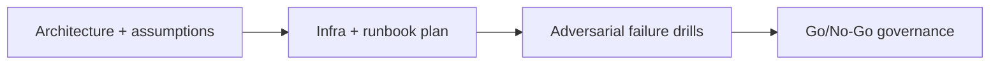

---

## 🏗️ Your Running Project

**What you're building:** An NFT marketplace on Solana — production-grade, end-to-end.
**What this module adds:** Understand network resilience — why client diversity protects your marketplace.
**What you'll have at the end:** A concrete deliverable that builds directly on the previous module.

> *This module is one piece of a game you've been playing since Module 0. Every decision you make here carries forward.*

# Advanced Validators — Client Diversity (Agave, Firedancer, Frankendancer) — Core Concepts

## 😄 Meme Opener
**Meme concept:** "We can run a validator" before counting hardware, bandwidth, and on-call reality.
**Why this hurts in real life:** validator ops fail from reliability and process gaps, not enthusiasm.

## Quick Recap
- Explore client diversity and resilience strategy across Agave and Firedancer paths, including the Frankendancer hybrid operational posture.
- This module is intentionally advanced and operations-heavy.
- Mission pass requires evidence-backed decisions, not hand-wavy plans.

## Concept Clarity
We use a three-stage method: architecture design, implementation runbook, and adversarial go-live gating.
No stage can be skipped if the goal is a resilient validator operation.

## Mermaid Visual

## Harvard-Style Case
**Context:** Team wants to run a validator but has limited staff and budget clarity.

**Decision point:** launch early with partial prep, or delay until reliability/economic thresholds are met?

**Action taken:** establish measurable requirements and hard release blockers.

**Outcome:** slower launch, significantly lower operational risk.

**Discussion questions:**
1. Which metric (latency, uptime, or cost) should be your hard blocker first?
2. What single incident would force immediate rollback?

## Primary References
- https://docs.anza.xyz/
- https://docs.firedancer.io/
- https://github.com/firedancer-io/firedancer

## Downloadable Practical Artifacts
- [Artifact](/assets/courses/solana-academy/downloads/21-client-diversity-firedancer-frankendancer-hardware-and-network-checklist.md)
- [Artifact](/assets/courses/solana-academy/downloads/21-client-diversity-firedancer-frankendancer-cost-model-template.csv)
- [Artifact](/assets/courses/solana-academy/downloads/21-client-diversity-firedancer-frankendancer-incident-runbook.md)

## Anti-Pattern to Avoid
Running consensus infra with no tested incident plan, no cost envelope, and no validated recovery path.
