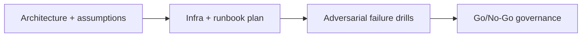

# Advanced Validators — Launch Readiness Mission — Adversarial Ops and Go-Live Gate

## 😄 Meme Opener
**Meme concept:** "We can run a validator" before counting hardware, bandwidth, and on-call reality.
**Why this hurts in real life:** validator ops fail from reliability and process gaps, not enthusiasm.

## Quick Recap
- Build an end-to-end validator launch plan covering architecture, funding assumptions, operations, incident response, and go/no-go criteria.
- This module is intentionally advanced and operations-heavy.
- Mission pass requires evidence-backed decisions, not hand-wavy plans.

## Concept Clarity
We use a three-stage method: architecture design, implementation runbook, and adversarial go-live gating.
No stage can be skipped if the goal is a resilient validator operation.

## Mermaid Visual

## Harvard-Style Case
**Context:** Team wants to run a validator but has limited staff and budget clarity.

**Decision point:** launch early with partial prep, or delay until reliability/economic thresholds are met?

**Action taken:** establish measurable requirements and hard release blockers.

**Outcome:** slower launch, significantly lower operational risk.

**Discussion questions:**
1. Which metric (latency, uptime, or cost) should be your hard blocker first?
2. What single incident would force immediate rollback?

## Primary References
- https://docs.anza.xyz/operations/setup-a-validator
- https://docs.anza.xyz/operations/guides/validator-start
- https://solana.com/validators

## Downloadable Practical Artifacts
- [Artifact](/assets/courses/solana-academy/downloads/22-validator-launch-readiness-mission-hardware-and-network-checklist.md)
- [Artifact](/assets/courses/solana-academy/downloads/22-validator-launch-readiness-mission-cost-model-template.csv)
- [Artifact](/assets/courses/solana-academy/downloads/22-validator-launch-readiness-mission-incident-runbook.md)

## 🤖 Solo AI Discussion Prompts

Use one of these with Claude or ChatGPT after you complete your validator launch readiness memo. Ask for questions, hints, and scoring before any suggested rewrite.

**Launch Readiness Chair:** "Act as the chair of a validator launch review. Ask me one question at a time about hardware, stake economics, key custody, monitoring, incident response, and rollback criteria. Give hints after weak answers; do not write the memo for me."

**Adversarial Ops Board:** "Simulate an adversarial ops board with validator SRE, security, and finance roles. Each role asks one readiness question before voting. End with the riskiest blocker I should investigate next."

## Anti-Pattern to Avoid
Running consensus infra with no tested incident plan, no cost envelope, and no validated recovery path.
