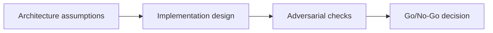

---

## 🏗️ Your Running Project

**What you're building:** An NFT marketplace on Solana — production-grade, end-to-end.
**What this module adds:** Ship the marketplace to mainnet with a documented go/no-go checklist.
**What you'll have at the end:** A concrete deliverable that builds directly on the previous module.

> *This module is one piece of a game you've been playing since Module 0. Every decision you make here carries forward.*

# Deployment + Mainnet Readiness — Overview

## 😄 Meme Opener
**Meme concept:** "Looks fine in dev" until assumptions meet production traffic.
**Why this hurts in real life:** reliability depends on explicit constraints, not optimism.

## Quick Recap
- Focus area: Promotion gates, incident runbooks, rollback drills, and production launch governance.
- This is part of the standard + mission-mode learning flow.
- Mission pass requires concrete evidence and explicit risk controls.

## Concept Clarity
The learning flow has three steps: architecture map, implementation lab, and adversarial gate.
Each step sharpens the model before you move toward production-like environments.

## Mermaid Visual

## Harvard-Style Case
**Case pack entry:** [Case 3: Launch Sequence Failure Despite Green Tests](/assets/courses/solana-academy/downloads/solana-case-pack-source-rigor.md)

**Case pack note:** synthetic teaching case derived from repo-owned Solana planning content; technical grounding comes from the linked Solana security, RPC, and fee docs.

**Context:** Local and devnet tests pass, but a production configuration mismatch appears because ordered launch gates were treated as guidance.

**Decision point:** preserve the launch date, ship partially, or enforce a hard gate with rollback proof before promotion?

**Discussion questions:**
1. Which failed launch check stops promotion even when tests are green?
2. What rollback proof would satisfy you before mainnet release?

## Primary References
- https://solana.com/docs/security
- https://solana.com/docs/rpc
- https://solana.com/docs/core/fees

## Downloadable Practical Artifacts
- [Artifact](/assets/courses/solana-academy/downloads/07-deployment-mission-runbook.md)
- [Artifact](/assets/courses/solana-academy/downloads/07-deployment-quality-matrix.csv)

## Anti-Pattern to Avoid
Skipping explicit constraints and adversarial checks because a single happy-path demo passed.
