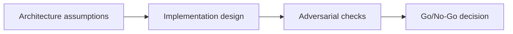

# Solana + Blockchain Fundamentals — Adversarial Gate

## 😄 Meme Opener
**Meme concept:** "Looks fine in dev" until assumptions meet production traffic.
**Why this hurts in real life:** reliability depends on explicit constraints, not optimism.

## Quick Recap
- Focus area: Account model, transaction lifecycle, authority boundaries, and state transition design.
- This is part of the standard + mission-mode learning flow.
- Mission pass requires concrete evidence and explicit risk controls.

## Concept Clarity
The learning flow has three steps: architecture map, implementation lab, and adversarial gate.
Each step sharpens the model before you move toward production-like environments.

## Mermaid Visual

## Harvard-Style Case
**Context:** Team shipped fast but encountered hidden failures caused by unclear constraints.

**Decision point:** keep velocity and patch later, or enforce mission gates and deterministic checks?

**Action taken:** the team adopted mission gates with explicit evidence for each promotion step.

**Outcome:** slower initial cycle, significantly better reliability and review quality.

**Discussion questions:**
1. Which assumption is most likely to fail under real usage?
2. What should block progression to the next stage?

## Primary References
- https://solana.com/docs/core/accounts
- https://solana.com/docs/core/transactions
- https://solana.com/docs/core/instructions

## Downloadable Practical Artifacts
- [Artifact](/assets/courses/solana-academy/downloads/01-foundations-mission-runbook.md)
- [Artifact](/assets/courses/solana-academy/downloads/01-foundations-quality-matrix.csv)

## 🤖 Solo AI Discussion Prompts

Use one of these with Claude or ChatGPT after you sketch your own account and transaction model. Ask for questions, hints, and scoring before any suggested rewrite.

**Mental Model Reviewer:** "Act as a Solana fundamentals reviewer. Ask me to explain accounts, signers, instructions, and state transitions in my own words. If I confuse a concept, give a small hint and ask a follow-up instead of supplying the final explanation. Score clarity, correctness, and missing assumptions."

**Red Team Tutor:** "Pretend my fundamentals model will guide a real program design. Ask me where authority boundaries, writable accounts, or transaction ordering could fail. Keep the review Socratic and hint-first; do not design the program for me."

## Anti-Pattern to Avoid
Skipping explicit constraints and adversarial checks because a single happy-path demo passed.
