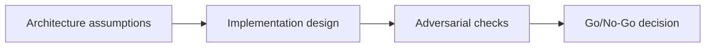

# Frontend + RPC Integration — Overview

## 😄 Meme Opener
**Meme concept:** "Looks fine in dev" until assumptions meet production traffic.
**Why this hurts in real life:** reliability depends on explicit constraints, not optimism.

## Quick Recap
- Focus area: Client architecture, RPC reliability, confirmation strategy, and observability for dApps.
- This is part of the standard + mission-mode learning flow.
- Mission pass requires concrete evidence and explicit risk controls.

## Concept Clarity
The learning flow has three steps: architecture map, implementation lab, and adversarial gate.
Each step sharpens the model before you move toward production-like environments.

## Mermaid Visual

## Harvard-Style Case
**Context:** Team shipped fast but encountered hidden failures caused by unclear constraints.

**Decision point:** keep velocity and patch later, or enforce mission gates and deterministic checks?

**Action taken:** the team adopted mission gates with explicit evidence for each promotion step.

**Outcome:** slower initial cycle, significantly better reliability and review quality.

**Discussion questions:**
1. Which assumption is most likely to fail under real usage?
2. What should block progression to the next stage?

## Primary References
- https://solana.com/docs/rpc
- https://solana.com/docs/core/transactions
- https://solana.com/docs/rpc/http/getlatestblockhash

## Downloadable Practical Artifacts
- [Artifact](/assets/courses/solana-academy/downloads/05-frontend-mission-runbook.md)
- [Artifact](/assets/courses/solana-academy/downloads/05-frontend-quality-matrix.csv)

## Anti-Pattern to Avoid
Skipping explicit constraints and adversarial checks because a single happy-path demo passed.
