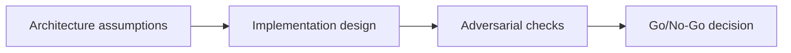

# Frontend + RPC Integration — Adversarial Gate

## 😄 Meme Opener
**Meme concept:** "Looks fine in dev" until assumptions meet production traffic.
**Why this hurts in real life:** reliability depends on explicit constraints, not optimism.

## Quick Recap
- Focus area: Client architecture, RPC reliability, confirmation strategy, and observability for dApps.
- This is part of the standard + mission-mode learning flow.
- Mission pass requires concrete evidence and explicit risk controls.

## Concept Clarity
The learning flow has three steps: architecture map, implementation lab, and adversarial gate.
Each step sharpens the model before you move toward production-like environments.

## Mermaid Visual

## Harvard-Style Case
**Context:** Team shipped fast but encountered hidden failures caused by unclear constraints.

**Decision point:** keep velocity and patch later, or enforce mission gates and deterministic checks?

**Action taken:** the team adopted mission gates with explicit evidence for each promotion step.

**Outcome:** slower initial cycle, significantly better reliability and review quality.

**Discussion questions:**
1. Which assumption is most likely to fail under real usage?
2. What should block progression to the next stage?

## Primary References
- https://solana.com/docs/rpc
- https://solana.com/docs/core/transactions
- https://solana.com/docs/rpc/http/getlatestblockhash

## Downloadable Practical Artifacts
- [Artifact](/assets/courses/solana-academy/downloads/05-frontend-mission-runbook.md)
- [Artifact](/assets/courses/solana-academy/downloads/05-frontend-quality-matrix.csv)

## 🤖 Solo AI Discussion Prompts

Use one of these with Claude or ChatGPT after you map your frontend and RPC flow. Ask for questions, hints, and scoring before any suggested rewrite.

**Transaction UX Reviewer:** "Act as a Solana frontend reviewer. Ask me how users inspect transactions, understand fees, handle RPC failure, and recover from rejected signatures. Give hints before recommendations, and do not write the UI copy for me."

**RPC Reliability Coach:** "Roleplay an incident-review coach for my frontend. Ask what happens when RPC data is stale, rate-limited, or inconsistent. Keep the review question-led and score the evidence I provide."

## Anti-Pattern to Avoid
Skipping explicit constraints and adversarial checks because a single happy-path demo passed.
