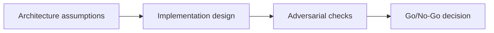

# On-Chain Program Design — Adversarial Gate

## 😄 Meme Opener
**Meme concept:** "Looks fine in dev" until assumptions meet production traffic.
**Why this hurts in real life:** reliability depends on explicit constraints, not optimism.

## Quick Recap
- Focus area: Program architecture, PDA strategy, account constraints, and secure instruction design.
- This is part of the standard + mission-mode learning flow.
- Mission pass requires concrete evidence and explicit risk controls.

## Concept Clarity
The learning flow has three steps: architecture map, implementation lab, and adversarial gate.
Each step sharpens the model before you move toward production-like environments.

## Mermaid Visual

## Harvard-Style Case
**Context:** Team shipped fast but encountered hidden failures caused by unclear constraints.

**Decision point:** keep velocity and patch later, or enforce mission gates and deterministic checks?

**Action taken:** the team adopted mission gates with explicit evidence for each promotion step.

**Outcome:** slower initial cycle, significantly better reliability and review quality.

**Discussion questions:**
1. Which assumption is most likely to fail under real usage?
2. What should block progression to the next stage?

## Primary References
- https://solana.com/docs/core/programs
- https://www.anchor-lang.com/docs/high-level-overview
- https://www.anchor-lang.com/docs/references/account-constraints

## Downloadable Practical Artifacts
- [Artifact](/assets/courses/solana-academy/downloads/04-onchain-mission-runbook.md)
- [Artifact](/assets/courses/solana-academy/downloads/04-onchain-quality-matrix.csv)

## 🤖 Solo AI Discussion Prompts

Use one of these with Claude or ChatGPT after you outline your program state machine. Ask for questions, hints, and scoring before any suggested rewrite.

**State Machine Reviewer:** "Act as a Solana program reviewer. Ask me one question at a time about accounts, authorities, constraints, state transitions, and failure modes. Give hints when an invariant is weak, but do not write the instruction logic for me."

**Adversarial Designer:** "Roleplay a cautious protocol designer reviewing my on-chain architecture. Challenge one assumption about ownership, mutability, or replay resistance at a time. Keep feedback Socratic and end with a rubric score."

## Anti-Pattern to Avoid
Skipping explicit constraints and adversarial checks because a single happy-path demo passed.
