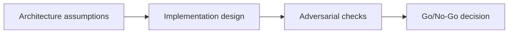

---

## 🏗️ Your Running Project

**What you're building:** An NFT marketplace on Solana — production-grade, end-to-end.
**What this module adds:** Set up the tools you'll use to build, test, and deploy the marketplace — CLI, local validator, Anchor.
**What you'll have at the end:** A concrete deliverable that builds directly on the previous module.

> *This module is one piece of a game you've been playing since Module 0. Every decision you make here carries forward.*

# Developer Tooling + Environments — Overview

## 😄 Meme Opener
**Meme concept:** "Looks fine in dev" until assumptions meet production traffic.
**Why this hurts in real life:** reliability depends on explicit constraints, not optimism.

## Quick Recap
- Focus area: CLI, local environments, deterministic tooling, and team workflow hygiene.
- This is part of the standard + mission-mode learning flow.
- Mission pass requires concrete evidence and explicit risk controls.

## Concept Clarity
The learning flow has three steps: architecture map, implementation lab, and adversarial gate.
Each step sharpens the model before you move toward production-like environments.

## Mermaid Visual

## Harvard-Style Case
**Context:** Team shipped fast but encountered hidden failures caused by unclear constraints.

**Decision point:** keep velocity and patch later, or enforce mission gates and deterministic checks?

**Action taken:** the team adopted mission gates with explicit evidence for each promotion step.

**Outcome:** slower initial cycle, significantly better reliability and review quality.

**Discussion questions:**
1. Which assumption is most likely to fail under real usage?
2. What should block progression to the next stage?

## Primary References
- https://solana.com/docs/intro/installation
- https://docs.anza.xyz/cli/usage
- https://solana.com/docs/intro/quick-start/writing-to-network

## Downloadable Practical Artifacts
- [Artifact](/assets/courses/solana-academy/downloads/02-tooling-mission-runbook.md)
- [Artifact](/assets/courses/solana-academy/downloads/02-tooling-quality-matrix.csv)

## Anti-Pattern to Avoid
Skipping explicit constraints and adversarial checks because a single happy-path demo passed.
