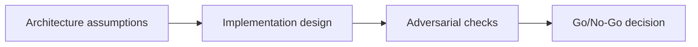

# Wallet Integration + Signing Flows — Adversarial Gate

## 😄 Meme Opener
**Meme concept:** "Looks fine in dev" until assumptions meet production traffic.
**Why this hurts in real life:** reliability depends on explicit constraints, not optimism.

## Quick Recap
- Focus area: Wallet UX, signer policy, transaction signing paths, and custody boundaries.
- This is part of the standard + mission-mode learning flow.
- Mission pass requires concrete evidence and explicit risk controls.

## Concept Clarity
The learning flow has three steps: architecture map, implementation lab, and adversarial gate.
Each step sharpens the model before you move toward production-like environments.

## Mermaid Visual

## Harvard-Style Case
**Context:** Team shipped fast but encountered hidden failures caused by unclear constraints.

**Decision point:** keep velocity and patch later, or enforce mission gates and deterministic checks?

**Action taken:** the team adopted mission gates with explicit evidence for each promotion step.

**Outcome:** slower initial cycle, significantly better reliability and review quality.

**Discussion questions:**
1. Which assumption is most likely to fail under real usage?
2. What should block progression to the next stage?

## Primary References
- https://solana.com/docs/core/transactions
- https://solana.com/docs/core/accounts
- https://solana.com/docs/rpc/http/sendtransaction

## Downloadable Practical Artifacts
- [Artifact](/assets/courses/solana-academy/downloads/03-wallets-mission-runbook.md)
- [Artifact](/assets/courses/solana-academy/downloads/03-wallets-quality-matrix.csv)

## 🤖 Solo AI Discussion Prompts

Use one of these with Claude or ChatGPT after you draft your wallet signing policy. Ask for questions, hints, and scoring before any suggested rewrite.

**Signer Policy Reviewer:** "Act as a wallet security reviewer. Ask me to justify each signer, transaction preview, approval step, and error state in my Solana flow. If I miss a risk, give a hint and ask me to revise before you score it."

**User Safety Board:** "Simulate a review board with a wallet engineer, security lead, and support lead. Each role asks one question about consent, phishing resistance, or failed signatures. Keep the discussion hint-first and do not write my final policy."

## Anti-Pattern to Avoid
Skipping explicit constraints and adversarial checks because a single happy-path demo passed.
